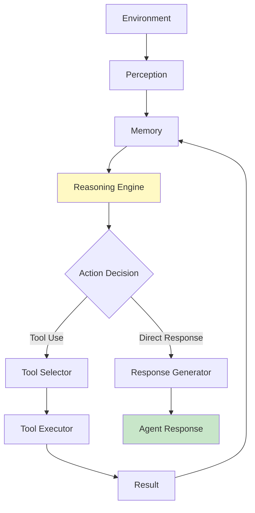

# Agent Architecture Patterns

## Question

Describe the typical architecture of an intelligent AI agent system.

## Answer

Agent architecture defines how an AI agent perceives its environment, reasons about goals, and takes actions. Different architectures suit different use cases.

### Core Components

1. **Perception Module** - Sensors and input processing
2. **Memory System** - Short-term and long-term storage
3. **Reasoning Engine** - Decision-making and planning
4. **Action Executor** - Tool calling and execution
5. **Feedback Loop** - Learning from outcomes

## Architecture Diagram

## References

- [Building AI Agents](https://github.com/openai/baselines)

---

**Related Topics**: What is Agentic AI, Tools and Functions

**Previous**: [What is Agentic AI?](./what-is-agentic-ai.md)
