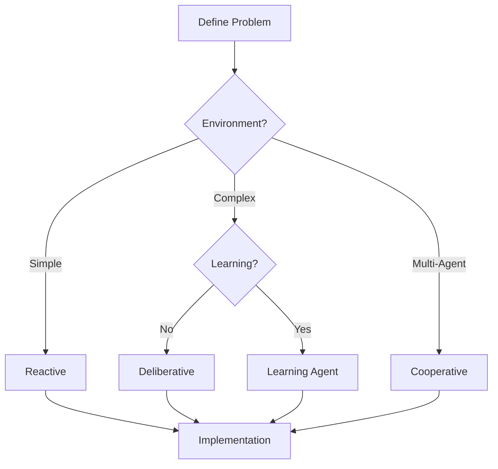

# Agent Types and Design Patterns

## Question
What types of AI agents exist and how do you choose the right architecture?

## Answer
Agents range from simple reactive systems to complex multi-agent ecosystems.

### Agent Taxonomy
- **Reactive Agents** - No memory, immediate response
- **Deliberative Agents** - Planning and reasoning
- **Learning Agents** - Adapt from experience
- **Cooperative Agents** - Collaborate toward goals
- **Hierarchical Agents** - Multi-level control

### Design Patterns
- **Loop Pattern** - Perceive, Think, Act
- **Planning Pattern** - Generate action sequences
- **Learning Pattern** - Update policy over time
- **Communication Pattern** - Inter-agent messaging

### Common Architectures
- **BDI (Belief-Desire-Intention)** - Deliberative framework
- **STRIPS** - Classical planning
- **Behavior Trees** - Hierarchical task execution
- **Reactive Rules** - Condition-action pairs
- **Goal-driven** - End-state specification

### Selection Factors
- **Problem Complexity** - Domain requirements
- **Uncertainty Level** - Stochastic vs deterministic
- **Time Constraints** - Real-time requirements
- **Resource Limits** - Computational budget
- **Adaptability Needs** - Learning requirements

## Agent Architecture Decision Tree

## Key Points
- Complexity should match problem requirements
- Reactive agents are simple but limited
- Planning agents handle complex environments
- Learning agents improve over time

## Interview Tips
- Explain agent selection criteria
- Discuss architecture trade-offs
- Share implementation experiences

## References
- [An Introduction to MultiAgent Systems](https://www.wiley.com/en-us/An+Introduction+to+MultiAgent+Systems%2C+2nd+Edition-p-9780470519462)
- [Behavior Trees in Robotics and Games](https://arxiv.org/abs/1709.00084)
