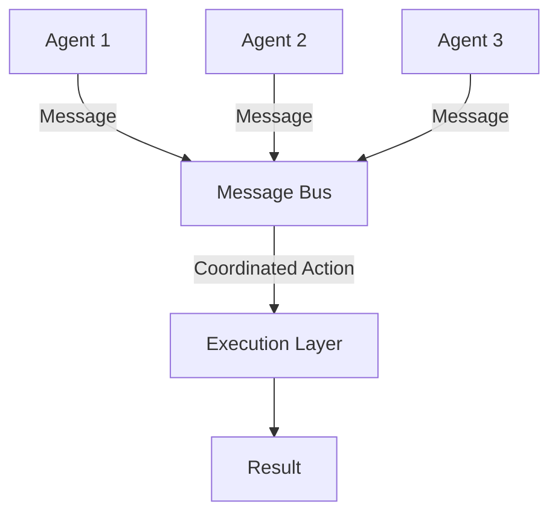

# Building Multi-Agent Systems

## Question
How do you design and coordinate multiple AI agents working together?

## Answer
Multi-agent systems require coordination mechanisms, communication protocols, and conflict resolution.

### Coordination Mechanisms
- **Centralized** - Single controller
- **Decentralized** - Peer-to-peer coordination
- **Hierarchical** - Layered authority
- **Market-based** - Auction mechanisms
- **Emergent** - Self-organizing behavior

### Communication Protocols
- **Direct Messages** - Agent-to-agent
- **Blackboard** - Shared state
- **Event-driven** - Publish-subscribe
- **RPC** - Remote procedure calls
- **Message Queues** - Async communication

### Cooperation Strategies
- **Task Allocation** - Divide work
- **Load Balancing** - Distribute load
- **Consensus** - Reach agreement
- **Negotiation** - Resolve conflicts
- **Coalition Formation** - Team building

### Common Patterns
- **Producer-Consumer** - Data pipeline
- **Request-Response** - Service calls
- **Pub-Sub** - Event distribution
- **Broker** - Mediated interaction
- **Workflow** - Sequential execution

### Challenges
- **Deadlocks** - Circular dependencies
- **Scalability** - Many agents
- **Heterogeneity** - Different types
- **Latency** - Communication delays
- **Consistency** - State synchronization

## Multi-Agent Architecture

## Key Points
- Choose coordination based on requirements
- Communication overhead limits scalability
- Fault tolerance essential for reliability
- Monitor inter-agent interactions

## Interview Tips
- Discuss coordination trade-offs
- Explain communication patterns
- Share large-scale deployment experience

## References
- [Multiagent Resource Allocation](https://www.springer.com/gp/book/9780262033428)
- [Designing Agent Systems](https://www.oreilly.com/library/view/designing-machine-learning/9781098107956/)
