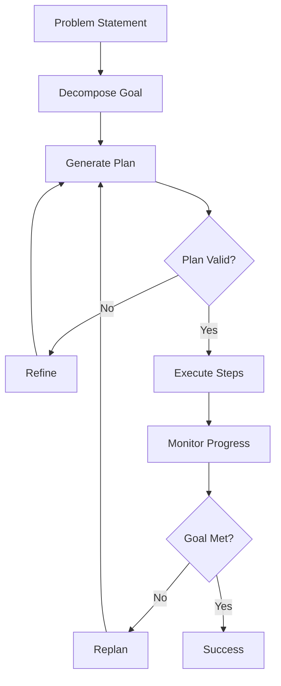

# Agent Planning and Reasoning Strategies

## Question
What planning and reasoning strategies do AI agents use to solve complex problems?

## Answer
Agents use various planning approaches to break down complex goals into actionable steps.

### Planning Strategies
- **Means-End Analysis** - Identify goal gaps
- **Breadth-First** - Explore all options
- **Depth-First** - Explore deep paths
- **A* Search** - Heuristic-guided search
- **Hierarchical Planning** - Multi-level abstraction

### Reasoning Techniques
- **Chain-of-Thought** - Step-by-step reasoning
- **Thought Trees** - Explore multiple paths
- **Backward Chaining** - Goal decomposition
- **Forward Chaining** - Data-driven inference
- **Abductive Reasoning** - Hypothesis generation

### Common Algorithms
- **STRIPS** - Classical planning
- **GraphPlan** - Planning graphs
- **HTN** - Hierarchical Task Network
- **PDDL** - Planning Domain Definition Language

### Prompt-Based Strategies
- **ReAct** - Reasoning + Acting
- **Plan & Execute** - Separate planning phase
- **Dynamic Planning** - Replan when needed
- **Adaptive Planning** - Learn from experience

### Problem-Specific Approaches
- **Code Generation** - Write and execute code
- **Mathematical Reasoning** - Step-by-step math
- **Logical Inference** - Deductive reasoning
- **Creative Problem-Solving** - Novel approaches

## Planning Process Flow

## Key Points
- Planning quality impacts success rate
- Hierarchical planning handles complexity
- Replanning handles environment changes
- Clear goal specification essential

## Interview Tips
- Explain planning algorithm selection
- Discuss trade-offs between approaches
- Share optimization techniques

## References
- [Chain-of-Thought Prompting](https://arxiv.org/abs/2201.11903)
- [ReAct: Synergizing Reasoning and Acting in Language Models](https://arxiv.org/abs/2210.03629)
