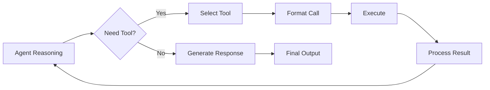

# Agent Tools and Function Calling

## Question
How do agents use tools and function calling to interact with external systems?

## Answer
Tools extend agent capabilities beyond language generation to take concrete actions.

### Tool Types
- **API Calls** - External services
- **Database Queries** - Data retrieval
- **File Operations** - Read/write files
- **Calculations** - Mathematical operations
- **Web Search** - Information retrieval
- **Code Execution** - Runtime evaluation

### Function Calling Process
1. **Detect Need** - Recognize when tool needed
2. **Select Tool** - Choose appropriate tool
3. **Format Call** - Structure parameters
4. **Execute** - Run the tool
5. **Process Result** - Use result in reasoning

### Implementation Approaches
- **OpenAI Function Calling** - Native LLM support
- **Tool Use Protocol** - Agent request format
- **Plugin Architecture** - Extensible system
- **Wrapper Pattern** - Adapter layer

### Best Practices
- **Clear Descriptions** - Tool documentation
- **Error Handling** - Graceful failures
- **Timeouts** - Prevent hangs
- **Rate Limiting** - Respect resource limits
- **Logging** - Track all operations

### Safety Considerations
- **Input Validation** - Sanitize parameters
- **Access Control** - Authorization checks
- **Resource Limits** - CPU/memory caps
- **Audit Trail** - Track operations
- **Sandboxing** - Isolated execution

## Tool Calling Loop

## Key Points
- Tools greatly expand agent capabilities
- Proper abstraction is essential
- Safety must be built in
- Error handling prevents cascading failures

## Interview Tips
- Explain tool selection criteria
- Discuss safety implementations
- Share production tool experiences

## References
- [OpenAI Function Calling](https://platform.openai.com/docs/guides/function-calling)
- [Tool Use in Large Language Models](https://arxiv.org/abs/2305.15553)
