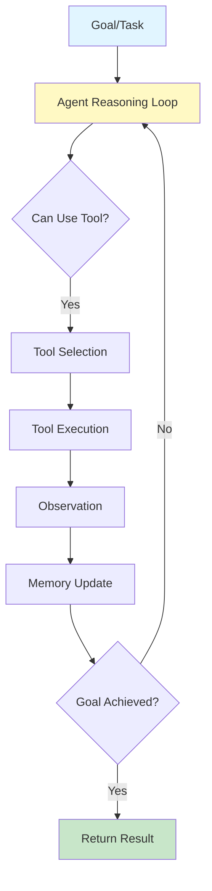

# What is Agentic AI?

## Question

What is Agentic AI and how does it differ from traditional LLM applications?

## Answer

**Agentic AI** refers to artificial intelligence systems that can autonomously plan, decide, and execute actions to accomplish goals. Unlike traditional LLM applications that respond to queries, agents operate iteratively, perceiving their environment, reasoning about goals, taking actions, and adapting based on results.

### Agent vs. LLM Application

```
Traditional LLM:
Input → Model → Output (Single step)

Agent:
Goal → Reasoning → Action → Observe → Reason → Action → ... → Goal Achieved
```

### Core Components of an Agent

1. **Perception**: Sensing the environment and available tools
2. **Reasoning**: Planning and decision-making using LLM
3. **Memory**: Storing context and past actions
4. **Action**: Executing tools and code
5. **Feedback Loop**: Learning from outcomes

## Architecture Diagram



## Key Points

✅ **Autonomous**: Can plan and execute without human intervention  
✅ **Tool-aware**: Can use external tools and APIs  
✅ **Iterative**: Reasons through multi-step problems  
✅ **Adaptive**: Learns from outcomes and adjusts strategy  
✅ **Complex**: Can solve problems that require planning  

## Interview Tips

1. Explain autonomy: "Agents can break down complex tasks into steps"
2. Give example: "Booking travel: agent searches flights, hotels, verifies budget"
3. Discuss loop: "Sense → Reason → Act → Observe → Repeat"
4. Mention challenges: "Hallucinations, tool errors, infinite loops"

## Common Agent Frameworks

- **ReAct**: Reasoning + Acting pattern
- **Tool Use**: Agents calling external tools
- **Planning**: Multi-step planning before execution
- **Multi-Agent**: Multiple agents collaborating

## References

- [ReAct Paper](https://arxiv.org/abs/2210.03629)
- [AutoGPT Architecture](https://github.com/Significant-Gravitas/AutoGPT)
- [LangChain Agents](https://python.langchain.com/docs/modules/agents/)

---

**Related Topics**: Tools and Functions, Multi-Agent Systems, Planning Strategies

**Next**: Learn about [Agent Architecture](./agent-architecture.md)
