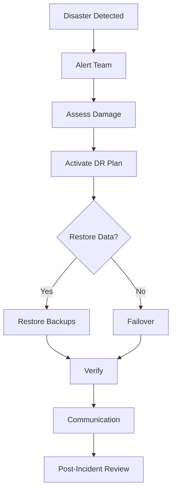

# Disaster Recovery and Business Continuity

## Question
How do you plan for and execute disaster recovery in AI systems?

## Answer
Disaster recovery requires planning, testing, and continuous preparation.

### Core Metrics
- **RTO** - Recovery Time Objective (max downtime)
- **RPO** - Recovery Point Objective (max data loss)
- **MTTR** - Mean Time To Recovery (actual time)
- **MTTF** - Mean Time To Failure (reliability)

### Backup Strategies
- **Full Backup** - Complete copy
- **Incremental** - Only changes
- **Differential** - Changes since last full
- **Snapshot** - Point-in-time copy
- **Continuous Replication** - Always current

### High Availability
- **Redundancy** - Duplicate systems
- **Failover** - Automatic switching
- **Load Balancing** - Distribute traffic
- **Health Checks** - Monitor status
- **Auto-recovery** - Automatic restart

### Disaster Recovery Plan
1. **Assess Risk** - Identify threats
2. **Define Objectives** - Set RTO/RPO
3. **Plan Strategy** - Backup and failover
4. **Implement** - Build capabilities
5. **Test** - Verify procedures
6. **Document** - Create runbooks
7. **Train** - Educate team
8. **Iterate** - Continuous improvement

### Testing Strategies
- **Backup Restore** - Test restores
- **Failover Drills** - Practice switching
- **Chaos Engineering** - Inject failures
- **Tabletop Exercises** - Team coordination
- **Full Disaster** - Complete simulation

### Geographic Distribution
```
Region 1 (Primary)
  ↓
Data Replication
  ↓
Region 2 (Standby)
  ↓
Health Monitoring
  ↓
Failover if needed
```

## Disaster Recovery Workflow


## Key Points
- Planning prevents panic during crisis
- Regular testing identifies gaps
- Geographic redundancy essential
- Clear communication critical

## Interview Tips
- Discuss RTO/RPO trade-offs
- Explain backup strategies
- Share incident responses

## References
- [Disaster Recovery Planning](https://www.gartner.com/en/topics/business-continuity)
- [AWS Well-Architected Framework](https://docs.aws.amazon.com/wellarchitected/)
