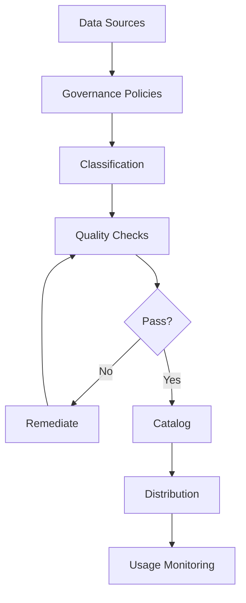

# Data Governance in AI Systems

## Question
How do you implement data governance for AI systems?

## Answer
Data governance ensures data quality, compliance, and ethical use.

### Governance Pillars
1. **Data Quality** - Accuracy and completeness
2. **Compliance** - Regulatory requirements
3. **Ethics** - Responsible AI
4. **Lineage** - Data provenance
5. **Access Control** - Permission management

### Data Classification
- **Public** - No restrictions
- **Internal** - Employee access
- **Confidential** - Limited access
- **Restricted** - Highest protection
- **PII** - Personal information

### Policies & Procedures
- **Data Retention** - Keep and delete schedules
- **Access Policies** - Who can access what
- **Quality Standards** - Minimum quality thresholds
- **Incident Response** - Data breach procedures
- **Audit Trails** - Track all access

### Master Data Management
```
Data Collection
     ↓
Validation & Cleansing
     ↓
Master Records
     ↓
Distribution
     ↓
Usage Monitoring
```

### Metadata Management
- **Catalog** - Discover data assets
- **Lineage** - Track data origins
- **Definitions** - Document meaning
- **Ownership** - Assign responsibility
- **SLA** - Service level agreements

### Tools & Technologies
- **Data Catalogs** - Collibra, Alation
- **MDM** - Master data management
- **DQ Tools** - Great Expectations
- **Metadata** - Apache Atlas
- **Governance** - OneTrust, Talend

## Data Governance Framework


## Key Points
- Clear policies prevent issues
- Automation scales governance
- Metadata enables discovery
- Continuous monitoring ensures compliance

## Interview Tips
- Discuss governance frameworks
- Explain compliance approaches
- Share implementation experiences

## References
- [Data Governance Framework](https://www.gartner.com/en/topics/data-governance)
- [CDO Playbook](https://www.oreilly.com/library/view/the-chief-data/9781492050697/)
