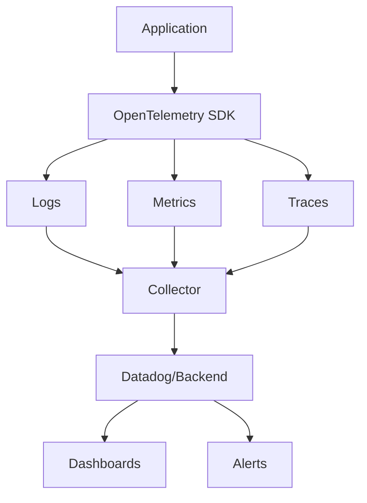

# Observability in AI Systems

## Question
How do you achieve observability in complex AI systems?

## Answer
Observability combines logging, metrics, and tracing for complete system visibility.

### Three Pillars
- **Logs** - Detailed events and errors
- **Metrics** - Quantitative measurements
- **Traces** - Request paths through system

### Logging Strategy
- **Structured Logging** - JSON format
- **Log Levels** - DEBUG, INFO, WARN, ERROR
- **Centralization** - ELK, Splunk
- **Retention** - Long-term storage
- **Sampling** - High-volume reduction

### Key Metrics
- **Availability** - System uptime
- **Latency** - Response time (p50, p95, p99)
- **Throughput** - Requests per second
- **Error Rate** - Failure percentage
- **Resource Usage** - CPU, Memory, Disk
- **Model Quality** - Output metrics

### Distributed Tracing
- **Trace ID** - Unique request identifier
- **Span** - Single operation
- **Parent-Child** - Request hierarchy
- **Duration** - Operation timing
- **Tags** - Context metadata

### Observability Stack
```
Application Code
        ↓
Instrumentation Libraries
        ↓
Collector (OpenTelemetry)
        ↓
Backend (Jaeger, Datadog)
        ↓
Visualization (Grafana)
        ↓
Analysis & Alerts
```

### Tools
- **Logging** - ELK, Splunk, Loki
- **Metrics** - Prometheus, Grafana
- **Tracing** - Jaeger, Zipkin
- **APM** - Datadog, New Relic
- **Observability** - OpenTelemetry

## Observability Architecture


## Key Points
- Instrument everything
- Use structured logging
- Correlation across services
- Alert on meaningful thresholds

## Interview Tips
- Discuss instrumentation approaches
- Explain metric selection
- Share debugging stories

## References
- [Observability Engineering](https://www.oreilly.com/library/view/observability-engineering/9781492076438/)
- [OpenTelemetry](https://opentelemetry.io/)
