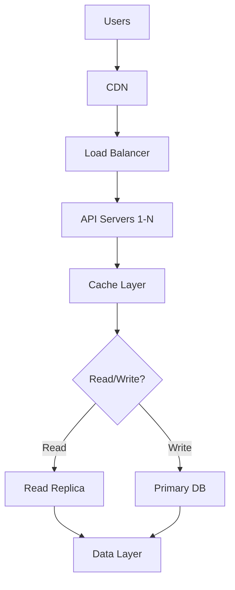

# Enterprise Scalability Patterns

## Question
What patterns ensure LLM systems scale to millions of users?

## Answer
Scalability requires thoughtful architecture design across all layers.

### Scalability Dimensions
- **Horizontal** - Add more servers
- **Vertical** - Increase server capacity
- **Functional** - Separate concerns
- **Geo-spatial** - Distribute globally
- **Temporal** - Handle traffic peaks

### Key Patterns
1. **Load Balancing** - Distribute requests
2. **Caching** - Reduce computation
3. **Queueing** - Manage bursts
4. **Sharding** - Partition data
5. **Replication** - Data redundancy
6. **CDN** - Edge distribution

### Architecture Tiers
```
Presentation Layer (Stateless)
         ↓
API Gateway (Load Balancing)
         ↓
Service Layer (Auto-scaling)
         ↓
Data Layer (Partitioned)
         ↓
Storage (Replicated)
```

### Caching Strategy
- **Client-side** - Browser caching
- **CDN** - Global distribution
- **Application** - Redis, Memcached
- **Database** - Query results
- **HTTP** - Cache headers

### Database Scaling
- **Replication** - Read replicas
- **Sharding** - Partition by key
- **Denormalization** - Optimize reads
- **Archival** - Move old data
- **Backup** - Data durability

## Scalability Architecture


## Key Points
- Design for scale from day one
- Use multiple caching layers
- Distribute globally for low latency
- Monitor capacity continuously

## Interview Tips
- Discuss scalability trade-offs
- Explain caching strategies
- Share production scaling stories

## References
- [The Art of Scalability](https://www.oreilly.com/library/view/the-art-of/9780134031408/)
- [Google SRE Book - Handling Overload](https://sre.google/books/)
