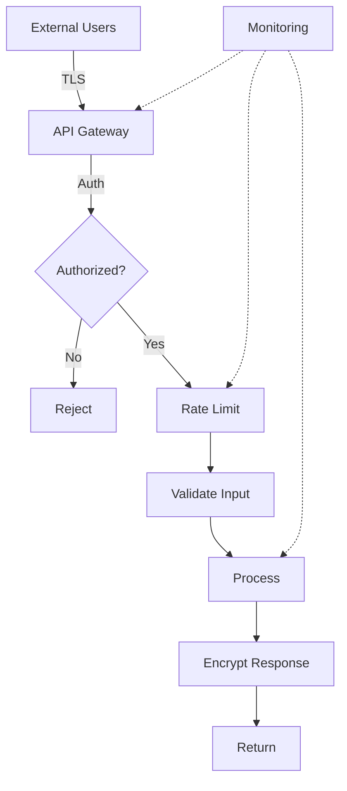

# Security and Privacy in AI Systems

## Question
How do you design secure and privacy-preserving AI systems?

## Answer
Security and privacy require defense-in-depth across all layers.

### Security Layers
1. **Network** - Encryption, firewalls
2. **Application** - Input validation, auth
3. **Data** - Encryption at rest/transit
4. **Identity** - Access control
5. **Audit** - Logging and monitoring

### Privacy Techniques
- **Data Minimization** - Collect only needed
- **Anonymization** - Remove identifiers
- **Encryption** - Protect data
- **Differential Privacy** - Add noise
- **Federated Learning** - Decentralized training

### Compliance Standards
- **GDPR** - EU data protection
- **CCPA** - California privacy
- **HIPAA** - Healthcare data
- **SOC 2** - Service organization
- **ISO 27001** - Information security

### Threats & Mitigations
| Threat | Mitigation |
|--------|-----------|
| Unauthorized Access | Authentication, RBAC |
| Data Breach | Encryption, monitoring |
| Model Extraction | Rate limiting, IP blocking |
| Prompt Injection | Input sanitization |
| Poisoning | Data validation |

### Encryption Strategy
- **In Transit** - TLS/HTTPS
- **At Rest** - AES-256
- **Key Management** - HSM, KMS
- **Rotation** - Regular key updates
- **Backup** - Encrypted backups

## Security Architecture

## Key Points
- Security is ongoing process
- Principle of least privilege
- Defense in depth approach
- Regular security audits

## Interview Tips
- Discuss threat modeling
- Explain compliance requirements
- Share security incident responses

## References
- [OWASP Top 10](https://owasp.org/www-project-top-ten/)
- [Privacy by Design](https://www.dataprotectionauthority.org/)
