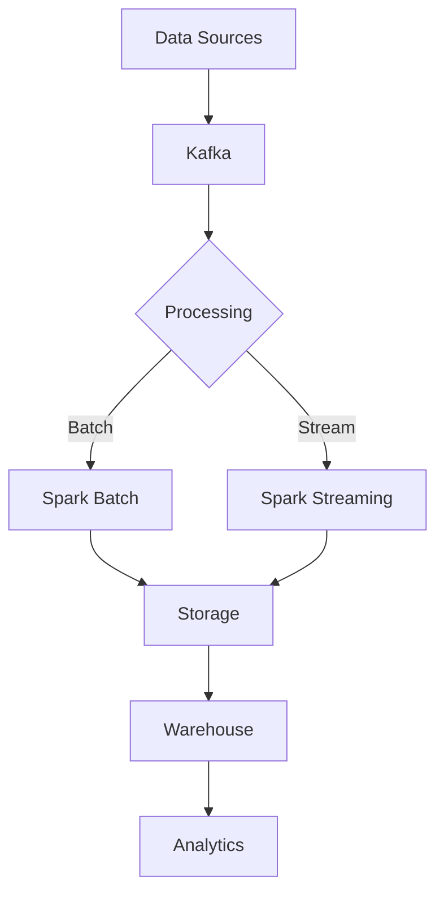

# Big Data Processing Tools

## Question
What tools are used for processing big data?

## Answer
Big data tools enable processing of massive datasets efficiently.

### Batch Processing
- **Hadoop** - Distributed file system + MapReduce
- **Spark** - Fast, in-memory processing
- **Hive** - SQL on Hadoop
- **Presto** - Interactive SQL
- **Flink** - Stream and batch

### Distributed Computing
- **MapReduce** - Original approach
- **Spark** - Faster, more general
- **Presto** - Interactive queries
- **Impala** - Real-time SQL
- **Dask** - Python parallel

### Data Formats
- **HDFS** - Hadoop distributed file system
- **Parquet** - Columnar format
- **ORC** - Optimized Row Columnar
- **Avro** - Row-based serialization
- **Protocol Buffers** - Structured data

### Processing Frameworks
```
Batch: Spark, Hadoop
Streaming: Kafka, Flink, Spark Streaming
Interactive: Presto, Impala
Graph: GraphX, Neptune
```

### Ecosystem
- **Data Ingestion** - Kafka, Flume
- **Processing** - Spark, Hadoop
- **Storage** - HDFS, S3
- **Warehousing** - Snowflake, BigQuery
- **Visualization** - Tableau, Looker

### Spark Advantages
- **Speed** - In-memory processing
- **Generality** - Batch, stream, ML, SQL
- **Fault Tolerance** - RDD lineage
- **Ease** - High-level APIs
- **Integration** - Works with existing tools

## Big Data Stack


## Key Points
- Spark most popular today
- Cloud-based tools reducing complexity
- Choose based on use case
- Cost considerations important

## Interview Tips
- Discuss tool trade-offs
- Explain Spark architecture
- Share big data experiences

## References
- [Learning Spark](https://www.oreilly.com/library/view/learning-spark/9781449359034/)
- [Spark Documentation](https://spark.apache.org/docs/latest/)
