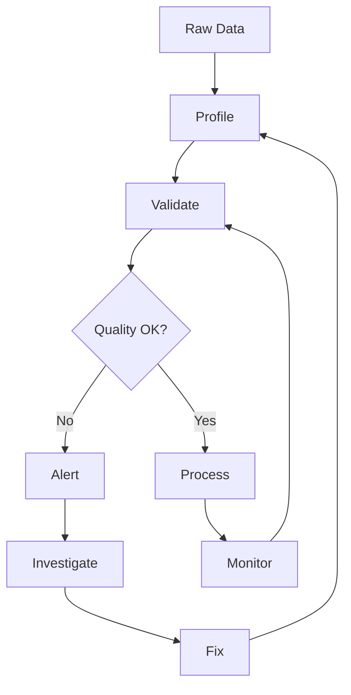

# Data Quality and Validation

## Question
How do you ensure and monitor data quality?

## Answer
Data quality is critical and requires systematic approaches.

### Quality Dimensions
- **Accuracy** - Correct values
- **Completeness** - No missing data
- **Consistency** - Uniform format
- **Timeliness** - Current data
- **Validity** - Proper ranges
- **Uniqueness** - No duplicates

### Quality Checks
```python
# Schema validation
assert column_type == expected_type

# Range checks
assert 0 <= age <= 150

# Uniqueness checks
assert no_duplicates(id_column)

# Referential integrity
assert foreign_key in referenced_table
```

### Tools
- **Great Expectations** - Python-based validation
- **dbt tests** - SQL-based testing
- **Soda** - Data quality monitoring
- **Apache Griffin** - Big data quality
- **Custom Scripts** - Domain-specific

### Quality Metrics
- **Completeness Ratio** - % non-null
- **Duplicate Ratio** - % duplicates
- **Accuracy Score** - % correct
- **Freshness** - Time since update
- **Conformity** - % matching schema

### Monitoring Strategy
1. **Define Metrics** - What to measure
2. **Baselines** - Expected values
3. **Alerts** - Threshold violations
4. **Investigations** - Root cause analysis
5. **Remediation** - Fix issues
6. **Learning** - Improve processes

### Data Profiling
- **Column Analysis** - Data distributions
- **Pattern Detection** - Anomalies
- **Relationship Analysis** - Dependencies
- **Historical Trending** - Changes over time
- **Outlier Detection** - Unusual values

## Data Quality Pipeline


## Key Points
- Prevention better than cure
- Automate quality checks
- Monitor continuously
- Document quality requirements

## Interview Tips
- Discuss quality dimensions
- Explain monitoring strategies
- Share quality improvement stories

## References
- [Data Quality Fundamentals](https://www.oreilly.com/library/view/data-quality-fundamentals/9781491917573/)
- [Great Expectations Documentation](https://docs.greatexpectations.io/)
