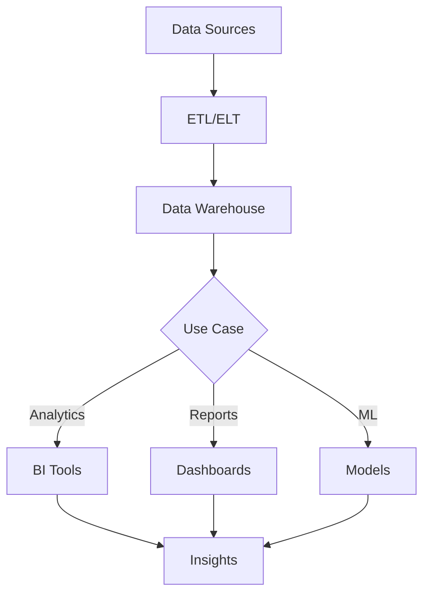

# Data Warehousing Concepts

## Question
What is a data warehouse and how is it designed?

## Answer
Data warehouses centralize data from multiple sources for analytics.

### Data Warehouse Characteristics
- **Centralized** - Single source of truth
- **Integrated** - Multiple sources
- **Time-variant** - Historical tracking
- **Non-volatile** - Stable, not transactional
- **Optimized** - Analytics queries

### Schema Designs
- **Star Schema** - Fact + dimensions
- **Snowflake Schema** - Normalized dimensions
- **Galaxy Schema** - Multiple fact tables
- **Denormalized** - Fast queries, redundant data

### Star Schema Example
```
          Customers
               |
Date --- Fact Table --- Products
               |
          Locations
```

### Architecture Layers
1. **Data Ingestion** - Sources
2. **Staging Area** - Temporary
3. **Integration Layer** - Consolidation
4. **Presentation Layer** - Analytics
5. **BI Layer** - Visualization

### Tools
- **Cloud Warehouses** - Snowflake, BigQuery, Redshift
- **Traditional** - Teradata, Oracle
- **Open Source** - Presto, Druid
- **Data Lakes** - Hadoop, Delta Lake

### Performance Optimization
- **Partitioning** - Data organization
- **Indexing** - Query acceleration
- **Materialized Views** - Pre-computed aggregates
- **Compression** - Storage reduction
- **Columnar Storage** - Query efficiency

## Data Warehouse Architecture


## Key Points
- Cloud data warehouses change economics
- Separation from OLTP improves performance
- Proper modeling essential
- Monitor query performance

## Interview Tips
- Discuss schema design
- Explain performance tuning
- Share warehouse implementations

## References
- [The Data Warehouse Toolkit](https://www.oreilly.com/library/view/the-data-warehouse/9781118530801/)
- [Snowflake Documentation](https://docs.snowflake.com/)
