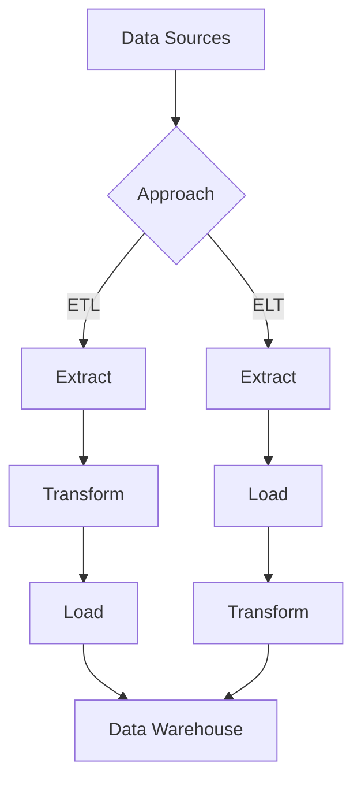

# ETL vs ELT Data Patterns

## Question
What are ETL and ELT, and when do you use each?

## Answer
ETL and ELT are two approaches to data integration with different trade-offs.

### ETL (Extract, Transform, Load)
1. **Extract** - Get data from sources
2. **Transform** - Clean and shape data
3. **Load** - Store in data warehouse

**Advantages:**
- Data quality validated before load
- Smaller data footprint
- Privacy preserved (early filtering)

**Disadvantages:**
- Bottleneck at transformation
- Expensive to reprocess
- Limited raw data access

### ELT (Extract, Load, Transform)
1. **Extract** - Get data from sources
2. **Load** - Store raw data
3. **Transform** - Process in warehouse

**Advantages:**
- Fast initial load
- Flexibility to reprocess
- Raw data available for analysis
- Easier to add new sources

**Disadvantages:**
- Data quality issues
- Large storage needs
- Sensitive data exposure risk

### Choosing Between ETL and ELT
```
Fast ingestion → ELT
Data quality critical → ETL
Limited storage → ETL
Flexible analytics → ELT
Sensitive data → ETL
```

### Tools
- **ETL**: Talend, Informatica, Pentaho
- **ELT**: dbt, Apache Spark
- **Hybrid**: Apache Airflow

### Data Lake Architecture (ELT)
```
Raw Zone → Processed Zone → Curated Zone
  ↓             ↓               ↓
Raw Data    Cleaned Data   Analytics Ready
```

## ETL vs ELT Comparison


## Key Points
- Cloud enables ELT economics
- Modern warehouses support complex transformations
- Start with quality over volume
- Monitor data quality regardless

## Interview Tips
- Explain trade-offs
- Discuss tool selection
- Share migration experiences

## References
- [ETL vs ELT Guide](https://www.oreilly.com/library/view/fundamentals-of-data/9781491922935/)
- [dbt Documentation](https://docs.getdbt.com/)
