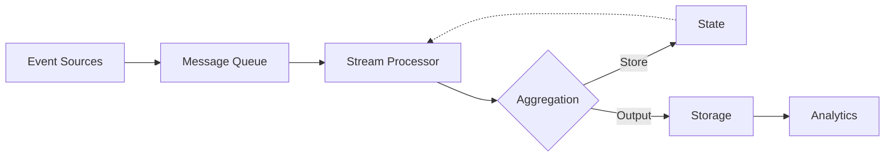

# Stream Processing Systems

## Question
How do you handle continuous data streams?

## Answer
Stream processing enables real-time data analytics and transformations.

### Stream vs Batch
| Aspect | Batch | Stream |
|--------|-------|--------|
| Latency | High | Low (ms-sec) |
| Throughput | High | Lower |
| Complexity | Simple | Complex |
| State | Stateless | Stateful |
| Use Case | Historical | Real-time |

### Streaming Concepts
- **Event Time** - When event occurred
- **Processing Time** - When processed
- **Watermark** - Progress indicator
- **Window** - Time/count grouping
- **State** - Tracked information

### Window Types
- **Tumbling** - Non-overlapping fixed
- **Sliding** - Overlapping fixed
- **Session** - Activity-based
- **Global** - All events

### Stream Processing Frameworks
- **Kafka Streams** - Simple, lightweight
- **Flink** - Complex, sophisticated
- **Spark Streaming** - Micro-batch
- **Storm** - Real-time processing
- **Kinesis** - AWS managed

### Use Cases
- **Real-time Analytics** - Dashboards
- **Fraud Detection** - Transaction monitoring
- **Recommendations** - Real-time suggestions
- **IoT** - Sensor data
- **Monitoring** - System health

### Challenges
- **Exactly-once Semantics** - Guarantee no duplicates
- **Ordering** - Maintain event order
- **State Management** - Track long-lived state
- **Backpressure** - Handle fast sources
- **Late Data** - Events arriving late

## Stream Processing Architecture

## Key Points
- Choose framework based on requirements
- Exactly-once processing critical for accuracy
- State management complex but necessary
- Monitor lag and backpressure

## Interview Tips
- Explain windowing concepts
- Discuss guarantees and trade-offs
- Share streaming experiences

## References
- [Designing Data-Intensive Applications](https://www.oreilly.com/library/view/designing-data-intensive/9781491902752/)
- [Apache Flink Documentation](https://flink.apache.org/docs/)
