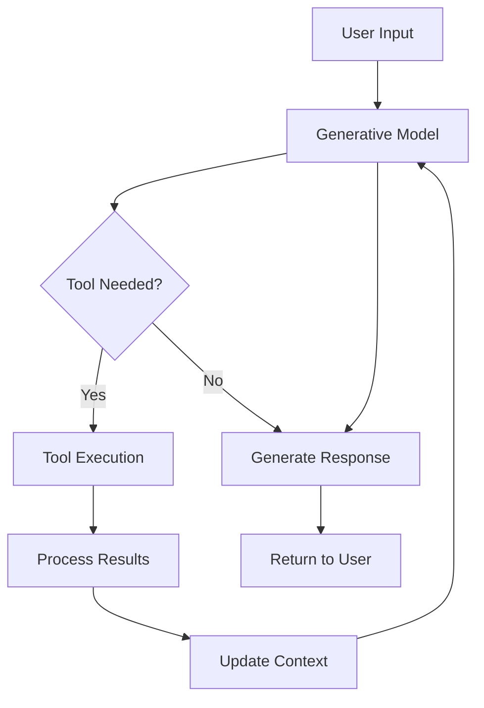

# Building Agents with Vertex AI

## Question
How do you build AI agents on Vertex AI?

## Answer
Vertex AI Agent Builder provides tools and services for creating autonomous agents.

### Agent Components
- **Generative AI API** - LLM backbone
- **Tool Execution** - Function calling
- **Planning Engine** - Goal decomposition
- **State Management** - Conversation history
- **Logging & Monitoring** - Observability

### Agent Capabilities
- **Tool Use** - Call external systems
- **Planning** - Break down goals
- **Reasoning** - Multi-step problem solving
- **Learning** - Adapt from feedback
- **Safety** - Content filtering

### Building an Agent
```python
from vertexai.generative_models import GenerativeModel, Tool

# Define tools
def search_documents(query):
    # Implement search
    return results

def get_user_info(user_id):
    # Fetch user information
    return user_data

# Create agent
model = GenerativeModel(
    "gemini-1.5-pro-preview-0409",
    tools=[search_documents, get_user_info]
)

# Execute agent
response = model.generate_content(
    "Find relevant documents for user 123"
)
```

### Agent Loop
1. **Perceive** - Understand input
2. **Plan** - Determine actions
3. **Act** - Execute tools
4. **Observe** - Process results
5. **Reason** - Update understanding
6. **Repeat** - Until goal achieved

### Multi-Turn Conversation
```python
messages = []

# User input
user_message = "What are my recent orders?"
messages.append({"role": "user", "content": user_message})

# Agent response
response = model.generate_content(messages)
agent_response = response.text
messages.append({"role": "model", "content": agent_response})

# Continue conversation
user_message = "What's the status of order 123?"
messages.append({"role": "user", "content": user_message})

# Agent continues
response = model.generate_content(messages)
```

### Deployment Options
- **Function** - Serverless execution
- **Cloud Run** - Containerized
- **Vertex AI Endpoints** - Managed deployment
- **Pub/Sub** - Event-driven
- **API** - RESTful interface

### Monitoring & Observability
- **Execution Logs** - Track actions
- **Tool Calls** - Monitor tool use
- **Latency** - Performance tracking
- **Errors** - Error monitoring
- **Cost** - Usage tracking

## Vertex AI Agent Architecture


## Key Points
- Fully managed agent infrastructure
- Simple tool integration
- Multi-turn conversations supported
- Auto-scaling handles load

## Interview Tips
- Discuss tool design patterns
- Explain agent loop mechanics
- Share production agent experiences

## References
- [Vertex AI Agent Builder](https://cloud.google.com/vertex-ai/docs/agent-builder/overview)
- [Agents Fundamentals](https://arxiv.org/abs/2310.08197)
