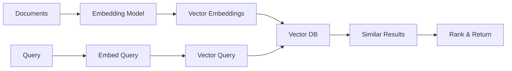

# Text Embeddings with Vertex AI

## Question
How do you generate and use text embeddings with Vertex AI?

## Answer
Vertex AI provides managed embedding services for semantic search and similarity tasks.

### Embedding Models
- **Embedding Gecko** - General-purpose embeddings
- **Multilingual** - 100+ languages support
- **Specialized** - Domain-specific versions

### Use Cases
- **Semantic Search** - Find similar documents
- **Clustering** - Group related content
- **Classification** - Assign categories
- **Recommendations** - Find similar items
- **Duplicate Detection** - Find duplicates

### Embedding Generation
```python
from vertexai.language_models import TextEmbeddingModel

model = TextEmbeddingModel.from_pretrained("textembedding-gecko@001")

embeddings = model.get_embeddings(
    ["Document 1", "Document 2"]
)

for text, embedding in zip(["Document 1", "Document 2"], embeddings):
    print(f"Embedding for '{text}': {embedding}")
```

### Vector Search Pipeline
1. **Document Ingestion** - Prepare documents
2. **Embedding Generation** - Convert to vectors
3. **Indexing** - Store vectors
4. **Query Processing** - Embed query
5. **Similarity Search** - Find top-k neighbors
6. **Ranking** - Rerank if needed

### Storing Embeddings
- **Vector DB** - Specialized storage
- **Cloud Storage** - File-based
- **Datastore** - Structured storage
- **BigQuery** - Analytics
- **Vertex Vector Search** - Native solution

### Similarity Metrics
- **Cosine Similarity** - Most common
- **Euclidean Distance** - Geometric
- **Dot Product** - Inner product
- **Manhattan Distance** - L1 norm

## Embedding Pipeline


## Key Points
- Embeddings enable semantic understanding
- Managed service reduces operational burden
- Multilingual support for global applications
- Integration with vector DBs for search

## Interview Tips
- Discuss similarity metrics
- Explain embedding use cases
- Share search system implementations

## References
- [Text Embeddings API](https://cloud.google.com/vertex-ai/docs/generative-ai/embeddings/get-text-embeddings)
- [Semantic Search Guide](https://arxiv.org/abs/1906.02776)
