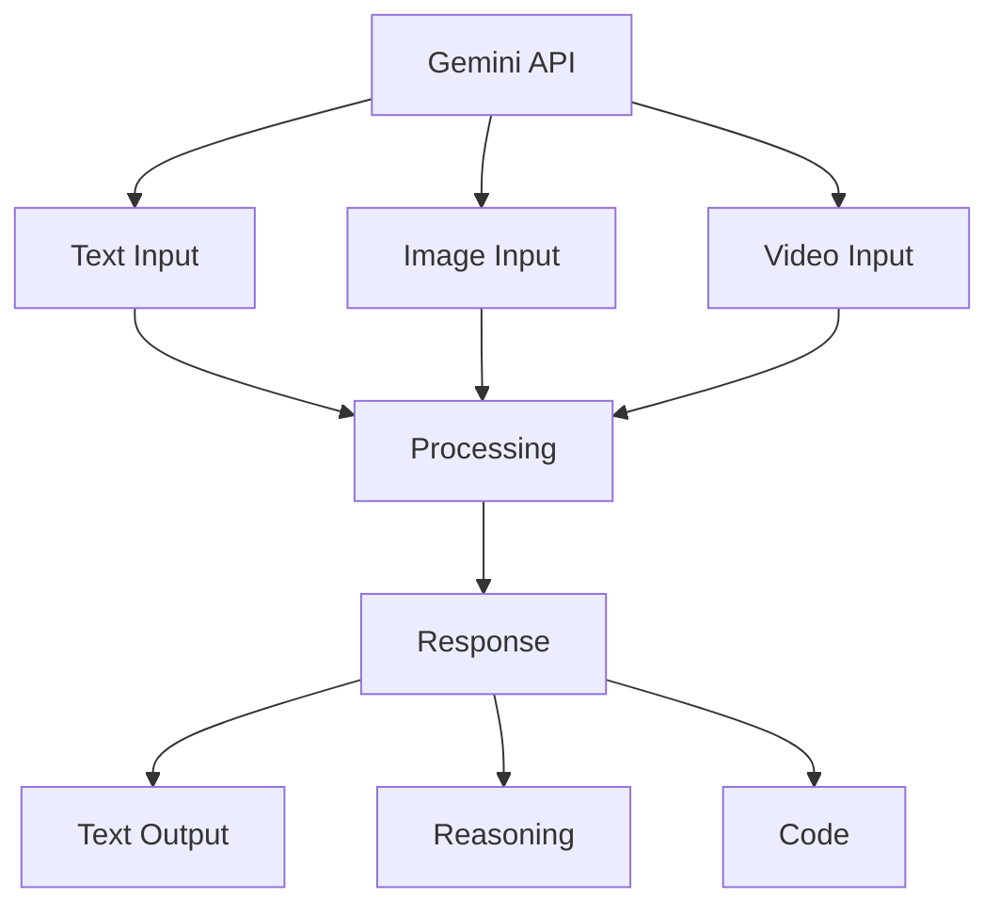

# Google Gemini API

## Question
What is Google Gemini and how do you use the Gemini API?

## Answer
Gemini is Google's advanced AI model supporting multimodal inputs including text, images, and video.

### Gemini Models
- **Gemini 1.5 Pro** - Most capable model
- **Gemini 1.5 Flash** - Fast, efficient model
- **Gemini 1.0 Pro** - Previous generation
- **Vision Model** - Image understanding

### Capabilities
- **Multimodal Input** - Text, images, video
- **Long Context** - Up to 1M tokens
- **Code Understanding** - Programming tasks
- **Reasoning** - Complex problem solving
- **Safety** - Built-in content filtering

### Use Cases
- **Document Analysis** - Extract information
- **Image Understanding** - Vision tasks
- **Code Generation** - Programming
- **Analysis & Summarization** - Large documents
- **Reasoning** - Complex problems

### API Integration
```python
import anthropic

client = anthropic.Anthropic(api_key="YOUR_API_KEY")

response = client.messages.create(
    model="claude-3-sonnet-20240229",
    messages=[
        {"role": "user", "content": "Explain neural networks"}
    ]
)
```

### Multimodal Example
```python
import base64

with open("image.jpg", "rb") as f:
    image_data = base64.standard_b64encode(f.read()).decode("utf-8")

response = client.messages.create(
    model="claude-3-sonnet-20240229",
    messages=[
        {
            "role": "user",
            "content": [
                {
                    "type": "image",
                    "source": {
                        "type": "base64",
                        "media_type": "image/jpeg",
                        "data": image_data
                    }
                },
                {
                    "type": "text",
                    "text": "Describe this image"
                }
            ]
        }
    ]
)
```

### Pricing
- **Input Tokens** - Per 1K tokens
- **Output Tokens** - Higher rate
- **Batch Processing** - Discounted rates
- **Enterprise** - Custom pricing

## Gemini API Features


## Key Points
- Multimodal capabilities expand use cases
- Long context window enables document analysis
- Advanced reasoning for complex problems
- Competitive pricing for capabilities

## Interview Tips
- Discuss multimodal use cases
- Explain context window utilization
- Share integration patterns

## References
- [Google Gemini API](https://ai.google.dev/gemini-api)
- [Multimodal AI Applications](https://arxiv.org/abs/2401.13601)
