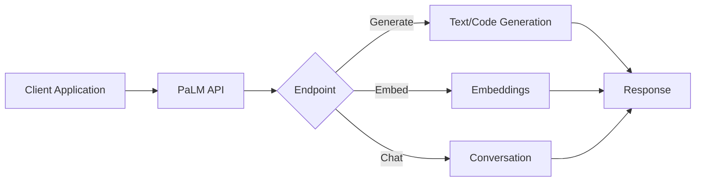

# Google PaLM API

## Question
What is the Google PaLM API and how do you use it?

## Answer
PaLM (Pathways Language Model) API provides access to Google's foundation models through a simple REST interface.

### PaLM Models
- **Text Bison** - General-purpose language model
- **Chat Bison** - Conversational model
- **Code Bison** - Code generation
- **Embedding Gecko** - Text embeddings

### Use Cases
- **Text Generation** - Creative writing, summaries
- **Chat Applications** - Conversational AI
- **Code Generation** - Programming assistance
- **Embeddings** - Semantic search, clustering
- **Q&A Systems** - Question answering

### API Endpoints
- **generateText** - Text generation
- **generateMessage** - Chat completion
- **embedText** - Generate embeddings
- **listModels** - Available models
- **getModel** - Model details

### Implementation Example
```python
import google.generativeai as genai

genai.configure(api_key="YOUR_API_KEY")

model = genai.GenerativeModel('palm-2-text-bison')
response = model.generate_content("Explain quantum computing")
print(response.text)
```

### Pricing Model
- **Free Tier** - Limited requests
- **Pay-as-you-go** - Per 1K tokens
- **Custom Pricing** - Enterprise volume

### Safety Features
- **Content Filtering** - Block harmful content
- **Safety Ratings** - Categorize responses
- **Harm Categories** - Multiple dimensions
- **Filtering Levels** - Configurable

## PaLM API Architecture


## Key Points
- Easy integration with REST API
- Multiple specialized models
- Safety features built-in
- Cost-effective for scaling

## Interview Tips
- Discuss model selection criteria
- Explain safety considerations
- Share integration experiences

## References
- [Google PaLM API Documentation](https://ai.google.dev/)
- [Generative AI on Vertex AI](https://cloud.google.com/generative-ai)
