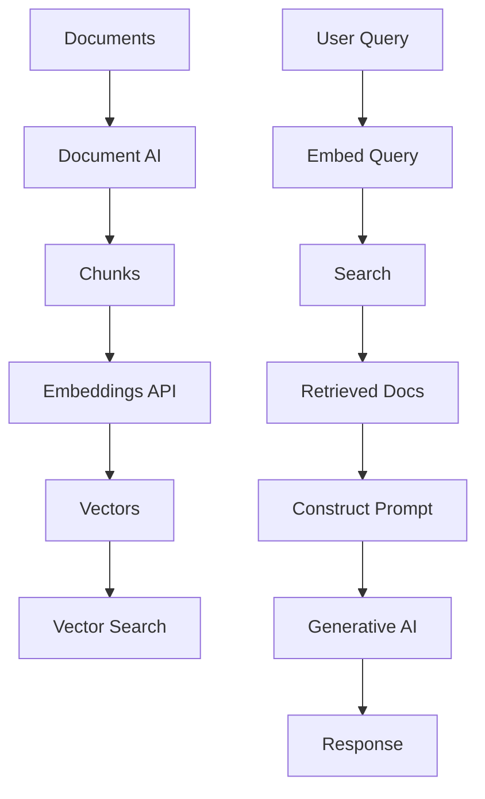

# Building RAG Systems on Vertex AI

## Question
How do you build RAG systems using Vertex AI services?

## Answer
Vertex AI provides integrated services for building end-to-end RAG systems.

### Vertex AI Components for RAG
- **Embeddings API** - Vector generation
- **Vector Search** - Similarity search
- **Generative AI API** - Text generation
- **Retrieval Augmented Generation** - Integrated service
- **Document AI** - Extract information

### RAG Architecture on GCP
```
Document Upload
      ↓
Document Processing (Document AI)
      ↓
Chunking & Embedding (Vertex Embeddings)
      ↓
Vector Storage (Vertex Vector Search)
      ↓
Query Processing
      ↓
Retrieval (Vector Search)
      ↓
Augmentation (Prompt Construction)
      ↓
Generation (Generative AI API)
      ↓
Response
```

### Implementation
```python
from vertexai.generative_models import GenerativeModel

model = GenerativeModel("gemini-1.5-pro-preview-0409")

# Upload document
document = {
    "mime_type": "text/plain",
    "data": "Document content here"
}

# Generate with context
response = model.generate_content(
    [
        document,
        "Question: What is the main topic?",
    ]
)
```

### Services Integration
- **Document AI** - Parse PDFs, images
- **Embeddings** - Convert text to vectors
- **Vector Search** - Find relevant docs
- **Gemini** - Generate responses
- **BigQuery** - Store and query

### Best Practices
- **Chunk Strategy** - Optimal chunk size
- **Embedding Updates** - Keep current
- **Reranking** - Improve relevance
- **Caching** - Reduce latency
- **Monitoring** - Track performance

### Cost Considerations
- **Per-character pricing** - Embeddings
- **Per-token pricing** - Generation
- **Storage costs** - Vector DB
- **Batch discounts** - Large jobs
- **Reserved capacity** - Cost reduction

## Vertex AI RAG Stack


## Key Points
- Integrated stack simplifies implementation
- Managed services reduce operational overhead
- Scalable to large document collections
- Cost-effective at scale

## Interview Tips
- Discuss system architecture
- Explain component selection
- Share production deployments

## References
- [Vertex AI Retrieval Augmented Generation](https://cloud.google.com/vertex-ai/docs/generative-ai/retrieval-augmented-generation/overview)
- [Building RAG Applications](https://arxiv.org/abs/2401.08406)
