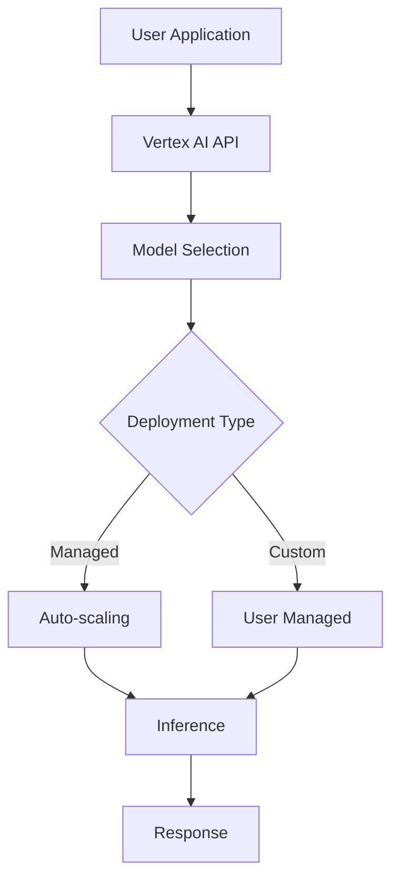

# Text Generation with Vertex AI

## Question
How do you use Vertex AI for text generation at scale?

## Answer
Vertex AI provides managed infrastructure for deploying and scaling text generation models.

### Vertex AI Services
- **Model Garden** - Pre-trained models
- **Generative AI API** - Managed access
- **Custom Training** - Fine-tuning
- **Endpoints** - Deployment
- **Batch Predictions** - Large-scale inference

### Text Generation Models
- **Gemini** - Google's latest model
- **PaLM** - Previous generation
- **Custom Models** - Fine-tuned versions

### Deployment Options
- **Managed APIs** - Fully managed
- **Self-managed** - Custom infrastructure
- **Batch Processing** - Large jobs
- **Real-time Endpoints** - Low latency
- **Scheduled Predictions** - Recurring jobs

### Implementation
```python
from vertexai.language_models import TextGenerationModel

model = TextGenerationModel.from_pretrained("text-bison@002")

response = model.predict(
    prompt="Write a product description for a laptop",
    max_output_tokens=256,
    temperature=0.8,
    top_p=0.95,
    top_k=40
)

print(response.text)
```

### Scaling Strategies
- **Auto-scaling** - Dynamic resource allocation
- **Load Balancing** - Distribute traffic
- **Batching** - Efficient processing
- **Caching** - Reduce redundant calls
- **Regional Distribution** - Reduce latency

### Cost Optimization
```
Cost per 1K Characters = Base Rate × Model Factor
Batch Cost = 60% discount vs real-time
Reserved Capacity = Further discounts
```

## Vertex AI Architecture


## Key Points
- Fully managed reduces operational burden
- Multiple deployment options for flexibility
- Auto-scaling handles variable load
- Batch processing cost-effective for large jobs

## Interview Tips
- Discuss deployment trade-offs
- Explain scaling strategies
- Share production patterns

## References
- [Vertex AI Generative AI](https://cloud.google.com/generative-ai)
- [Model Deployment Best Practices](https://cloud.google.com/architecture/serving-llms)
