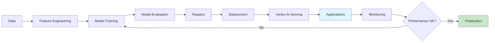

# Google Cloud Vertex AI Overview

## Question

What is Google Cloud Vertex AI and how does it support Generative AI workflows?

## Answer

**Vertex AI** is Google Cloud's unified machine learning platform that provides end-to-end capabilities for building, deploying, and managing AI models. It integrates with Google's generative AI services including Gemini API, and provides tools for the complete ML lifecycle.

### Vertex AI Components

```
┌─────────────────────────────────┐
│       Vertex AI Platform         │
├─────────────────────────────────┤
│  Generative AI Models           │
│  ├─ Gemini API                  │
│  ├─ PaLM API (Legacy)           │
│  └─ Custom Models               │
├─────────────────────────────────┤
│  Model Development              │
│  ├─ Workbench                   │
│  ├─ Notebooks                   │
│  └─ Training Services           │
├─────────────────────────────────┤
│  Deployment & Serving           │
│  ├─ Model Registry              │
│  ├─ Model Monitoring            │
│  └─ Prediction Service          │
└─────────────────────────────────┘
```

### Key Services

| Service | Purpose |
|---------|---------|
| **Gemini API** | Multi-modal LLM (text, vision, audio) |
| **Workbench** | Jupyter-based notebook environment |
| **AutoML** | Automated model training |
| **Pipelines** | MLOps workflow orchestration |
| **Model Registry** | Version and deployment management |
| **Feature Store** | Centralized feature management |
| **Explainable AI** | Model interpretability tools |

## Generative AI Workflow



## Key Features

✅ **Fully Managed**: Google handles infrastructure  
✅ **Scalable**: Auto-scaling for varying loads  
✅ **Integrated**: Works with other GCP services  
✅ **Monitoring**: Built-in observability  
✅ **Generative AI**: Pre-trained models ready to use  

## Interview Tips

1. "Vertex AI is Google's unified ML platform"
2. "Supports complete ML lifecycle: develop → deploy → monitor"
3. "Gemini API provides state-of-the-art generative capabilities"
4. "Integrates with GCP ecosystem (BigQuery, Cloud Storage, etc.)"

## Common Use Cases

- **RAG Systems**: Build RAG pipelines using Gemini + Vector Search
- **Custom Models**: Fine-tune models on your data
- **Batch Predictions**: Process large datasets
- **Real-time API**: Deploy models as microservices

## References

- [Vertex AI Documentation](https://cloud.google.com/vertex-ai/docs)
- [Gemini API Guide](https://cloud.google.com/vertex-ai/docs/generative-ai/gemini-user-guide)
- [Vertex AI Samples](https://github.com/GoogleCloudPlatform/vertex-ai-samples)

---

**Related Topics**: Gemini API, Text Generation, RAG on Vertex

**Next**: Explore [Gemini API](./gemini-api.md)
