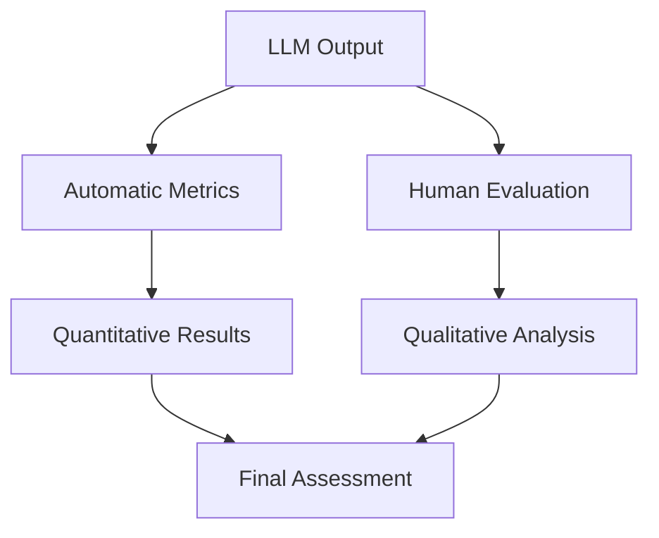

# Evaluating Large Language Models

## Question
What metrics do you use to evaluate LLM performance?

## Answer
LLM evaluation requires multiple metrics to assess different dimensions of model quality.

### Automatic Metrics
- **BLEU** - Bilingual Evaluation Understudy (translation)
- **ROUGE** - Recall-Oriented Understudy for Gisting Evaluation (summarization)
- **METEOR** - Machine Translation Evaluation
- **BERTScore** - Semantic similarity using embeddings
- **Perplexity** - Probability of text sequences

### Task-Specific Metrics
- **Classification** - Precision, Recall, F1-Score, AUC-ROC
- **Generation** - BLEU, ROUGE, METEOR, CIDEr
- **Retrieval** - MRR, NDCG, MAP
- **Question Answering** - Exact Match, F1-Score

### Human Evaluation Dimensions
- **Relevance** - Does the response answer the question?
- **Factuality** - Is the information accurate?
- **Fluency** - Is the text grammatically correct?
- **Coherence** - Is the response logically structured?
- **Safety** - Are there harmful outputs?

### Evaluation Framework
1. **Define Metrics** - Choose relevant evaluation metrics
2. **Create Test Set** - Prepare diverse test cases
3. **Run Evaluation** - Generate predictions
4. **Human Review** - Conduct manual evaluation
5. **Analyze Results** - Identify gaps and improvements

## Architecture Diagram

## Key Points
- Combine automatic and human evaluation
- Task-specific metrics matter most
- Benchmark against baseline models
- Continuously monitor production performance

## Interview Tips
- Discuss limitations of automatic metrics
- Explain why human evaluation is necessary
- Share experience with evaluation frameworks

## References
- [GLUE: A Multi-Task Benchmark and Analysis Platform](https://arxiv.org/abs/1804.07461)
- [SuperGLUE: A Stickier Benchmark for General-Purpose Language Understanding](https://arxiv.org/abs/1905.00537)
- [BERTScore: Evaluating Text Generation with BERT](https://arxiv.org/abs/1904.09675)
