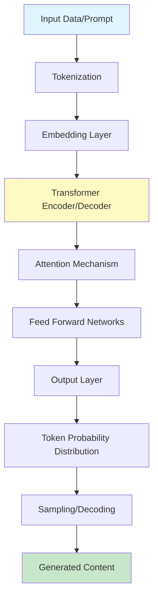

# What is Generative AI?

## Question

What is Generative AI and how does it differ from traditional machine learning?

## Answer

**Generative AI** refers to artificial intelligence systems capable of generating new content—text, images, code, audio, or video—based on patterns learned from training data. Unlike traditional ML models that classify or predict based on input data, generative models learn the underlying distribution of data and can create entirely new examples.

### Key Differences from Traditional ML

| Aspect | Traditional ML | Generative AI |
|--------|---|---|
| **Objective** | Classification, Regression, Clustering | Content Generation |
| **Output** | Labels, Predictions, Categories | New Original Content |
| **Architecture** | Decision Trees, SVMs, Neural Networks | Transformers, GANs, Diffusion Models |
| **Data Consumption** | Smaller datasets often sufficient | Requires massive datasets |
| **Compute Requirements** | Moderate | Extremely High |
| **Training Time** | Hours to Days | Weeks to Months |

### Core Generative AI Techniques

#### 1. **Transformer Models**
- Foundation for modern LLMs (GPT, BERT, T5)
- Uses attention mechanisms
- Can process sequences of any length
- Parallelizable during training

#### 2. **Large Language Models (LLMs)**
```
Traditional ML:  Input → Classifier → Output Label
LLMs:           Input Prompt → Model → Generated Text
```

- Trained on massive text corpora
- Learn statistical patterns in language
- Can perform diverse tasks via prompting
- Examples: GPT-4, Claude, Gemini

#### 3. **Diffusion Models**
- Generate images iteratively by denoising
- Start with random noise, gradually refine
- Used in DALL-E, Midjourney, Stable Diffusion

#### 4. **Generative Adversarial Networks (GANs)**
- Two networks: Generator vs Discriminator
- Competitive training process
- Excellent for image generation

### Common Applications

- **Text**: ChatGPT, content creation, code generation
- **Images**: DALL-E, image editing, style transfer
- **Code**: GitHub Copilot, code completion
- **Audio**: Voice synthesis, music generation
- **Video**: Video synthesis, animation

## Architecture Diagram



## Key Points

✅ **Generative AI learns data distributions**, not just mappings  
✅ **Transformer architecture revolutionized the field** with attention mechanisms  
✅ **LLMs are the current frontier** of practical generative AI  
✅ **Requires enormous compute and data** compared to traditional ML  
✅ **Can be fine-tuned for specific domains** after pre-training  
✅ **Evaluation is complex** - traditional metrics don't always apply  

## Interview Tips

1. **Explain the intuition**: "Generative AI learns what data looks like, not just how to classify it"
2. **Give concrete examples**: GPT generates text, DALL-E generates images
3. **Contrast with traditional ML**: Emphasize data distribution learning vs. supervised mappings
4. **Mention compute costs**: Shows understanding of practical considerations
5. **Discuss applications**: Demonstrate business value understanding

## Common Follow-up Questions

**Q: What's the difference between generative and discriminative models?**
- Discriminative: Learn P(Y|X) - directly map inputs to outputs
- Generative: Learn P(X,Y) - understand joint distribution

**Q: How do LLMs generate text sequentially?**
- Token by token, using previous tokens as context
- Each step predicts the most likely next token
- Process continues until end token or max length

**Q: What's the computational cost of training LLMs?**
- Modern LLMs: Millions to billions of dollars
- GPU hours: Often exceeds 1 million GPU-hours
- Training time: 3-6 months for large models

## References

- [Attention Is All You Need](https://arxiv.org/abs/1706.03762) - Transformer paper
- [OpenAI GPT Series Papers](https://openai.com/research/gpt-4)
- [Generative AI Overview - Google Cloud](https://cloud.google.com/ai/generative-ai)
- [DeepLearning.AI Short Courses](https://www.deeplearning.ai/)

---

**Related Topics**: LLM Fundamentals, Prompt Engineering, Fine-tuning

**Next**: Learn about [LLM Fundamentals](./llm-fundamentals.md)
