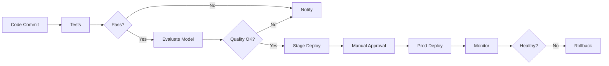

# CI/CD Pipelines for LLM Applications

## Question
How do you implement CI/CD for LLM-based applications?

## Answer
LLM CI/CD includes code testing, model evaluation, and deployment automation.

### CI/CD Stages
1. **Code Review** - Quality checks
2. **Unit Testing** - Component validation
3. **Integration Testing** - System testing
4. **Model Evaluation** - Quality assessment
5. **Staging** - Pre-production testing
6. **Production Deployment** - Live release
7. **Monitoring** - Ongoing validation

### Testing Strategy
- **Unit Tests** - Component functionality
- **Integration Tests** - System interaction
- **Regression Tests** - Prevent breakage
- **Prompt Tests** - Output quality
- **Safety Tests** - Toxicity, bias
- **Performance Tests** - Latency, throughput

### Evaluation in CI/CD
```
def evaluate_model():
    results = run_benchmarks()
    if results['quality'] < THRESHOLD:
        fail_build()
    if results['latency_p95'] > MAX_LATENCY:
        fail_build()
    if results['cost'] > BUDGET:
        warn_build()
```

### Deployment Strategies
- **Blue-Green** - Zero-downtime deployment
- **Canary** - Gradual rollout
- **A/B Testing** - Compare versions
- **Feature Flags** - Controlled rollout
- **Rollback** - Quick recovery

### Automation Tools
- **GitHub Actions** - CI/CD workflow
- **GitLab CI** - Pipeline automation
- **Jenkins** - Continuous integration
- **ArgoCD** - GitOps deployment
- **Terraform** - Infrastructure as code

## LLM CI/CD Pipeline


## Key Points
- Automate testing and quality checks
- Quality gates prevent bad deployments
- Gradual rollouts reduce risk
- Continuous monitoring enables quick recovery

## Interview Tips
- Discuss automation strategies
- Explain quality gate selection
- Share deployment experiences

## References
- [ML DevOps Best Practices](https://www.oreilly.com/library/view/machine-learning-devops/9781098136697/)
- [GitHub Actions for ML](https://github.com/features/actions)
