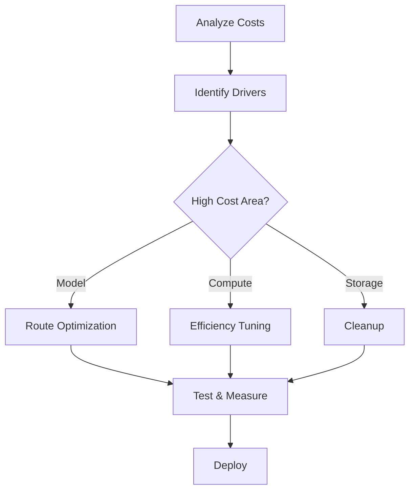

# LLMOps Cost Optimization

## Question
How do you optimize costs for LLM deployments at scale?

## Answer
Cost optimization involves efficient resource usage, smart caching, and model selection.

### Cost Components
- **Model Inference** - API calls or hardware
- **Compute** - GPU/CPU utilization
- **Storage** - Data and vectors
- **Bandwidth** - Data transfer
- **Operations** - Monitoring, logging

### Optimization Strategies
- **Model Routing** - Use cheaper models when appropriate
- **Batch Processing** - Process multiple requests
- **Caching** - Avoid redundant computation
- **Rate Limiting** - Control usage
- **Tiered Pricing** - Volume discounts

### Implementation Techniques
1. **Smart Routing** - Route to appropriate model
2. **Request Caching** - Cache frequent queries
3. **Compression** - Reduce token count
4. **Quantization** - Reduce model size
5. **Distillation** - Smaller models

### Cost Calculation
```
Total Cost = 
  (Input Tokens × Input Rate) +
  (Output Tokens × Output Rate) +
  Infrastructure Cost
  
Cost per Request = Total Cost / Request Count
```

### Cost Monitoring
- **Per-Request Cost** - Individual request expenses
- **Per-User Cost** - Aggregate user expenses
- **Per-Feature Cost** - Feature-level tracking
- **Budget Alerts** - Prevent overruns
- **Forecasting** - Project future costs

### Trade-offs
| Strategy | Cost Reduction | Trade-off |
|----------|---|---|
| Cheaper Model | 70% | Lower quality |
| Caching | 60% | Stale results |
| Batching | 40% | Higher latency |
| Quantization | 50% | Speed reduction |

## Cost Optimization Workflow


## Key Points
- Continuous cost monitoring essential
- Trade-offs between cost and quality
- Routing and caching provide 60%+ savings
- Automation reduces manual overhead

## Interview Tips
- Discuss cost analysis methodologies
- Explain optimization trade-offs
- Share cost reduction successes

## References
- [LLM Cost Analysis](https://www.oreilly.com/library/view/build-a-large/9781492097662/)
- [Cost Optimization Patterns](https://aws.amazon.com/blogs/ml/cost-optimization-for-ml/)
