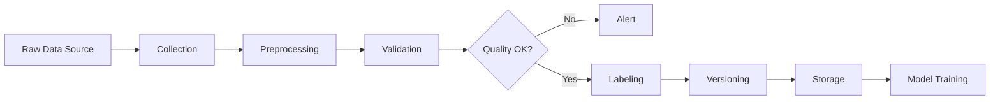

# Building LLMOps Data Pipelines

## Question
How do you design and implement data pipelines for LLM operations?

## Answer
Data pipelines ensure consistent quality data for training, fine-tuning, and evaluation.

### Pipeline Stages
1. **Data Collection** - Gather raw data
2. **Preprocessing** - Clean and normalize
3. **Validation** - Quality checks
4. **Labeling** - Annotation if needed
5. **Versioning** - Track datasets
6. **Storage** - Persistent management

### Data Quality Checks
- **Completeness** - No missing values
- **Accuracy** - Correct data
- **Consistency** - Uniform format
- **Timeliness** - Current data
- **Validity** - Proper ranges

### Processing Techniques
- **Tokenization** - Text splitting
- **Normalization** - Format consistency
- **Deduplication** - Remove duplicates
- **Filtering** - Remove outliers
- **Augmentation** - Expand dataset

### Storage Solutions
- **Data Lakes** - Raw data storage
- **Data Warehouses** - Structured storage
- **Feature Stores** - ML features
- **Version Control** - Dataset versioning
- **Backup** - Data redundancy

### Orchestration Tools
- **Airflow** - DAG-based workflows
- **Prefect** - Modern orchestration
- **Dagster** - Data-aware orchestration
- **dbt** - Data transformation
- **Kubernetes** - Container orchestration

## Data Pipeline Architecture

## Key Points
- Data quality directly impacts model quality
- Automation essential for scale
- Versioning enables reproducibility
- Monitoring detects drift early

## Interview Tips
- Discuss pipeline design patterns
- Explain quality monitoring
- Share production pipeline experiences

## References
- [Data Engineering Best Practices](https://www.oreilly.com/library/view/fundamentals-of-data/9781491922935/)
- [ML Data Lifecycle](https://arxiv.org/abs/2202.07267)
