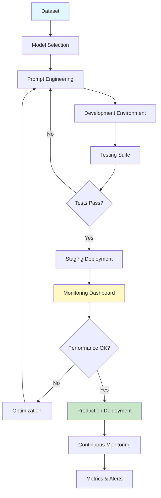

# LLMOps Lifecycle

## Question

Describe the complete lifecycle of an LLMOps pipeline and key considerations at each stage.

## Answer

**LLMOps (Large Language Model Operations)** encompasses all practices, tools, and processes for developing, deploying, monitoring, and managing LLM applications in production. It extends DevOps principles to the unique challenges of LLM systems.

### LLMOps Lifecycle Stages

```
1. Planning → 2. Development → 3. Evaluation
    ↓            ↓                ↓
    ← ← ← ← ← ← ← ← ← ← ← ← ← ← ← ← ← 
                  ↓
         4. Deployment → 5. Monitoring → 6. Optimization
                ↑ ← ← ← ← ← ← ← ← ← ← ← ← ↓
                         (Continuous)
```

## Stages in Detail

### 1. Planning Phase
- Define objectives and use cases
- Identify data requirements
- Plan infrastructure
- Set success metrics

### 2. Development Phase
- Model selection
- Prompt engineering
- RAG system design
- Tool/function definition
- Testing and validation

### 3. Evaluation Phase
- Benchmark selection
- Automated testing
- Human evaluation
- Cost analysis
- Performance metrics

### 4. Deployment Phase
- Containerization
- Version management
- Rollout strategy
- Infrastructure setup
- Security hardening

### 5. Monitoring Phase
- Performance tracking
- Latency monitoring
- Cost tracking
- User feedback collection
- Error tracking

### 6. Optimization Phase
- Fine-tuning on user data
- Prompt optimization
- Model updates
- Cost reduction
- Performance improvement

## Architecture Diagram



## Key Considerations

| Stage | Key Considerations |
|-------|---|
| **Planning** | Use case fit, data availability, budget, timeline |
| **Development** | Model capability, latency, cost, accuracy |
| **Evaluation** | Bias detection, factuality, consistency, safety |
| **Deployment** | Scalability, reliability, security, compliance |
| **Monitoring** | Drift detection, feedback loops, SLA compliance |
| **Optimization** | Cost vs. quality, user satisfaction, new capabilities |

## Key Points

✅ **Iterative process**: Continuous improvement cycle  
✅ **Multi-dimensional metrics**: Not just accuracy  
✅ **Cost awareness**: LLMs are expensive to operate  
✅ **Safety considerations**: Monitoring for harmful outputs  
✅ **Feedback loops**: Learn from production data  

## Interview Tips

1. "LLMOps is adapting DevOps for unique LLM challenges"
2. "Key stages: dev → eval → deploy → monitor → optimize"
3. "Metrics matter: accuracy, cost, latency, safety"
4. "Continuous learning: use production feedback for improvement"

## References

- [LLMOps Best Practices](https://mlops.community/llmops/)
- [Hugging Face Production Guidelines](https://huggingface.co/docs/transformers/deployment)
- [Anthropic Prompt Engineering Guide](https://docs.anthropic.com/)

---

**Related Topics**: Model Selection, Monitoring & Logging, CI/CD for LLMs

**Next**: Learn about [Model Selection](./model-selection.md)
