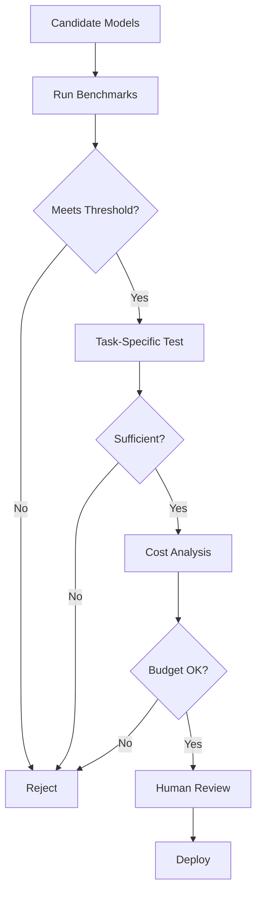

# LLMOps: Model Selection and Evaluation

## Question
How do you select and evaluate LLMs for production use?

## Answer
Model selection requires careful evaluation across multiple dimensions.

### Selection Criteria
- **Task Alignment** - Domain suitability
- **Performance** - Benchmark scores
- **Cost** - Inference expenses
- **Latency** - Response time
- **Size** - Memory requirements
- **Safety** - Toxicity, bias

### Evaluation Approaches
- **Benchmark Datasets** - Standard tests
- **Task-Specific Tests** - Real use cases
- **Human Evaluation** - Quality assessment
- **Stress Testing** - Edge cases
- **Bias Testing** - Fairness checks

### Benchmarks
- **GLUE** - NLU tasks
- **SuperGLUE** - Harder NLU
- **MMLU** - Knowledge tests
- **HumanEval** - Code generation
- **HELM** - Comprehensive evaluation

### Cost Analysis
```
Cost = (Model Size × Inference Cost) + (Training Cost)
Quality = Task Performance + Safety + Robustness
ROI = Benefit / (Cost + Maintenance)
```

### Decision Matrix
| Criteria | Weight | Model A | Model B |
|----------|--------|---------|---------|
| Quality | 40% | 9/10 | 8/10 |
| Cost | 30% | 7/10 | 9/10 |
| Latency | 20% | 8/10 | 6/10 |
| Safety | 10% | 9/10 | 7/10 |

## Model Evaluation Pipeline


## Key Points
- Multiple evaluation dimensions essential
- Benchmarks guide but don't determine
- Cost-quality trade-offs important
- Continuous monitoring post-deployment

## Interview Tips
- Discuss evaluation methodologies
- Explain selection trade-offs
- Share production selection stories

## References
- [HELM: Holistic Evaluation of Language Models](https://arxiv.org/abs/2211.09110)
- [Model Card Toolkit](https://github.com/tensorflow/model-card-toolkit)
