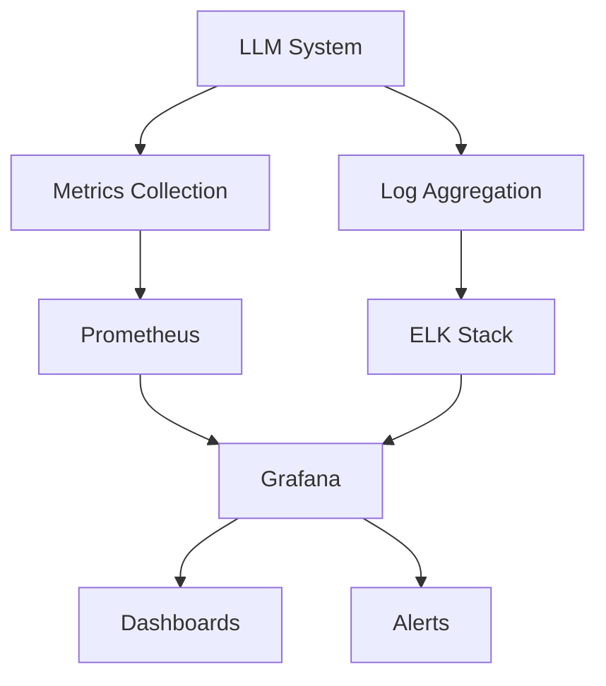

# LLMOps Monitoring and Logging

## Question
How do you monitor and log LLM systems in production?

## Answer
Comprehensive monitoring ensures reliability, performance, and quality.

### Key Metrics
- **Availability** - Uptime percentage
- **Latency** - Response time (p50, p95, p99)
- **Throughput** - Requests per second
- **Cost** - Inference cost per request
- **Quality** - Output quality metrics
- **Error Rate** - Failure percentage

### Quality Metrics
- **Relevance** - Answer appropriateness
- **Accuracy** - Factuality checks
- **Toxicity** - Harmful content detection
- **Latency** - Response time
- **Consistency** - Reproducibility

### Logging Strategy
- **Request Logs** - Input/output tracking
- **Performance Logs** - Latency, throughput
- **Error Logs** - Failures and exceptions
- **Audit Logs** - Security tracking
- **User Logs** - Usage patterns

### Monitoring Tools
- **Prometheus** - Metrics collection
- **Grafana** - Visualization
- **ELK Stack** - Log aggregation
- **DataDog** - APM platform
- **New Relic** - Observability

### Alerting Thresholds
```
Availability < 99.9% → Critical Alert
Latency p95 > 2s → Warning
Error Rate > 1% → Warning
Quality Score < 0.8 → Review
```

### Dashboard Components
- **System Health** - Overall status
- **Performance Metrics** - Latency, throughput
- **Cost Tracking** - Expense monitoring
- **Quality Metrics** - Output assessment
- **Incidents** - Issues and resolution

## Monitoring Architecture


## Key Points
- Monitor all three pillars: performance, quality, cost
- Automated alerts prevent outages
- Historical data enables trend analysis
- Logs are essential for debugging

## Interview Tips
- Discuss metric selection
- Explain alerting strategies
- Share observability implementations

## References
- [The USE Method](https://www.brendangregg.com/usemethod.html)
- [Google SRE Book - Monitoring Distributed Systems](https://sre.google/books/)
