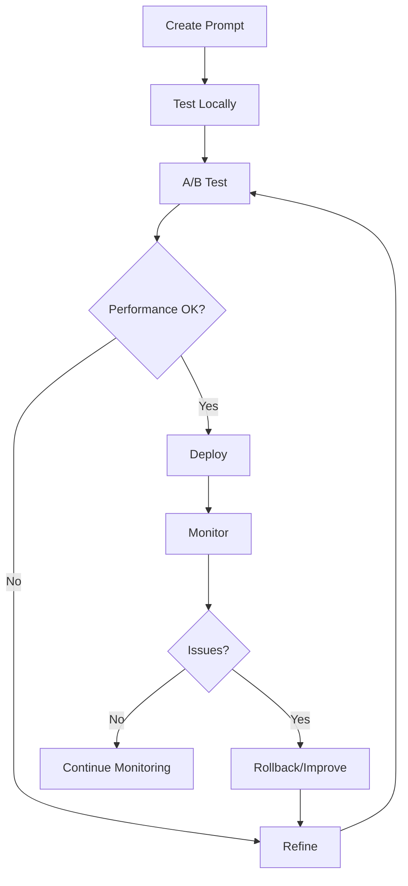

# Prompt Management in Production

## Question
How do you manage and version prompts in production LLM systems?

## Answer
Prompt management ensures consistency, quality, and continuous improvement.

### Prompt Components
- **System Message** - LLM instructions
- **User Input** - Query or request
- **Context** - Background information
- **Examples** - Few-shot demonstrations
- **Constraints** - Output specifications

### Version Control
```
prompts/
├── v1/
│   ├── system.txt
│   ├── examples.json
│   └── metadata.yaml
├── v2/
│   ├── system.txt
│   ├── examples.json
│   └── metadata.yaml
└── active.txt (points to v2)
```

### Prompt Testing
- **Consistency Tests** - Same input → same output
- **Quality Tests** - Meets quality criteria
- **Edge Case Tests** - Handles unusual inputs
- **Regression Tests** - Prevents breakage
- **Bias Tests** - Fairness checks

### Optimization Techniques
- **Prompt Templates** - Reusable patterns
- **A/B Testing** - Compare versions
- **Iterative Refinement** - Continuous improvement
- **Chain-of-Thought** - Step-by-step reasoning
- **Few-Shot Learning** - Provide examples

### Prompt Registry
```json
{
  "name": "customer-support",
  "version": "2.1.0",
  "status": "active",
  "created": "2024-01-15",
  "updated": "2024-06-07",
  "owner": "support-team",
  "quality_score": 0.92,
  "cost_per_request": 0.0015
}
```

### Management Tools
- **Git** - Version control
- **Prompt Management Platforms** - Dedicated tools
- **Experimentation Frameworks** - A/B testing
- **Monitoring** - Performance tracking
- **Feedback Systems** - User input collection

## Prompt Lifecycle


## Key Points
- Version control is essential
- Automated testing prevents regressions
- A/B testing drives improvement
- Feedback loops enable continuous optimization

## Interview Tips
- Discuss version control strategies
- Explain testing approaches
- Share prompt optimization experiences

## References
- [Prompt Engineering Guide](https://www.promptingguide.ai/)
- [LLM Prompt Engineering](https://arxiv.org/abs/2401.07550)
