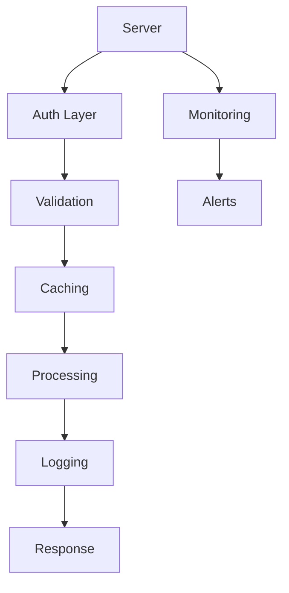

# MCP Implementation Best Practices

## Question
What are the best practices for implementing MCP servers and clients?

## Answer
Following best practices ensures robust, maintainable MCP implementations.

### Server Design
- **Stateless Design** - Avoid client-specific state
- **Idempotency** - Safe to retry operations
- **Resource Versioning** - Handle updates
- **Pagination** - Large result sets
- **Caching** - Performance optimization

### Client Design
- **Connection Pooling** - Reuse connections
- **Retry Logic** - Handle transient failures
- **Timeout Management** - Prevent hangs
- **Error Recovery** - Graceful degradation
- **Logging** - Debug and monitoring

### Security Best Practices
- **TLS/HTTPS** - Encrypt communication
- **Authentication** - Verify clients
- **Authorization** - Control access
- **Input Validation** - Prevent injection
- **Audit Logging** - Track operations

### Performance Optimization
- **Batching** - Combine requests
- **Caching** - Reduce server load
- **Compression** - Smaller payloads
- **CDN** - Content distribution
- **Rate Limiting** - Fair use

### Monitoring and Observability
- **Metrics** - Request counts, latency
- **Traces** - Request paths
- **Logs** - Detailed events
- **Alerts** - Anomaly detection
- **Dashboards** - Visual monitoring

### API Versioning
```
GET /api/v1/resources
POST /api/v2/resources
```

## MCP Best Practices Architecture


## Key Points
- Design for statelessness
- Security by default
- Observable systems
- Performance matters
- Plan for growth

## Interview Tips
- Discuss production challenges
- Explain monitoring strategies
- Share scaling experiences

## References
- [API Best Practices](https://swagger.io/resources/articles/best-practices-in-api-design/)
- [Secure API Design](https://owasp.org/www-project-api-security/)
