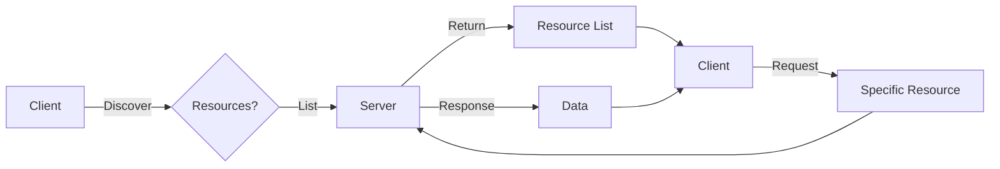

# MCP Client-Server Implementation

## Question
How do you implement MCP client-server communication?

## Answer
MCP uses JSON-RPC 2.0 over various transports for reliable communication.

### Transport Options
- **HTTP** - Request-response model
- **Server-Sent Events (SSE)** - Server push
- **stdio** - Process pipes
- **WebSocket** - Bidirectional

### Client Implementation
```typescript
// Connect to MCP server
const client = new MCPClient({
  transport: 'http',
  url: 'https://mcp-server.example.com'
});

// List available resources
const resources = await client.resources.list();

// Use a resource
const data = await client.resources.get('/documents/123');

// Call a tool
const result = await client.tools.call('search', {
  query: 'AI techniques'
});
```

### Server Implementation
- **Resource Handler** - Expose data
- **Tool Handler** - Execute functions
- **Prompt Handler** - Serve templates
- **Error Handler** - Exception management

### Message Format
- **Request** - Method, parameters, ID
- **Response** - Result or error
- **Notification** - One-way message
- **Batching** - Multiple messages

### Error Handling
- **Protocol Errors** - Invalid format
- **Server Errors** - Execution failures
- **Client Errors** - Bad requests
- **Timeouts** - Slow responses
- **Retries** - Automatic recovery

## Client-Server Communication Flow


## Key Points
- JSON-RPC 2.0 ensures compatibility
- Transport-agnostic design enables flexibility
- Error handling ensures reliability
- Timeouts prevent indefinite hangs

## Interview Tips
- Discuss transport trade-offs
- Explain error recovery strategies
- Share production patterns

## References
- [JSON-RPC 2.0 Specification](https://www.jsonrpc.org/specification)
- [HTTP/2 for API Design](https://tools.ietf.org/html/rfc7540)
