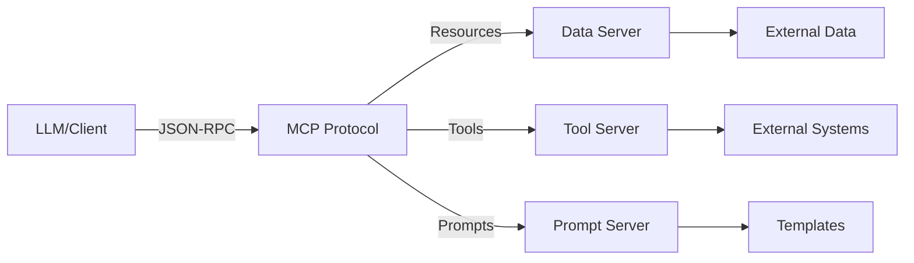

# Model Context Protocol Architecture

## Question
What is the architecture of the Model Context Protocol?

## Answer
MCP provides a standardized protocol for connecting LLMs to external data sources and tools.

### Architecture Components
- **Client** - LLM or application
- **Server** - Data/tool provider
- **Protocol** - JSON-RPC 2.0 based
- **Transport** - HTTP, SSE, stdio

### Protocol Layers
- **Connection Layer** - Establish and manage connections
- **Message Layer** - Structured communication
- **Resource Layer** - Data and tool exposure
- **Capability Layer** - Feature negotiation

### Key Concepts
- **Resources** - Text, binary, URIs
- **Tools** - Callable functions
- **Prompts** - Pre-defined templates
- **Sampling** - LLM completion requests

### Message Flow
1. **Initialization** - Client and server handshake
2. **Discovery** - Client lists resources/tools
3. **Interaction** - Client uses resources
4. **Completion** - Optional LLM sampling

### Security Model
- **Authentication** - Custom per implementation
- **Encryption** - TLS support
- **Rate Limiting** - Prevent abuse
- **Input Validation** - Parameter checking
- **Output Filtering** - Result filtering

## MCP Architecture Diagram

## Key Points
- Standardized protocol enables interoperability
- Loose coupling between client and server
- Extensible design for new capabilities
- Simple yet powerful message model

## Interview Tips
- Explain MCP benefits
- Discuss security implications
- Share integration experiences

## References
- [Anthropic Model Context Protocol](https://modelcontextprotocol.io/)
- [MCP Specification](https://github.com/modelcontextprotocol/specification)
