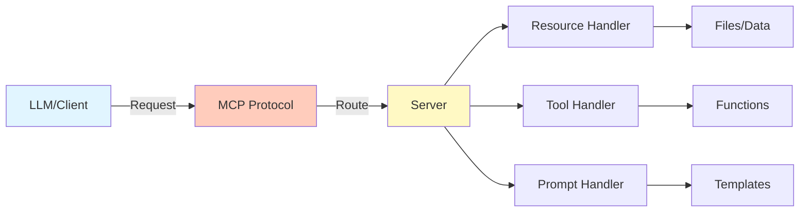

# MCP Fundamentals

## Question

What is the Model Context Protocol (MCP) and why is it important for AI systems?

## Answer

The **Model Context Protocol (MCP)** is a standardized interface for connecting large language models to external data sources, tools, and systems. It enables LLMs to securely access and interact with various applications and services through a unified, standardized protocol.

### MCP Architecture

```
Client (LLM)
    ↓
[Standardized Protocol]
    ↓
Server (Tools/Data)
    - File systems
    - Databases
    - APIs
    - Custom Services
```

### Key Components

1. **Resources**: Data sources exposed by servers
2. **Tools**: Functions that clients can call
3. **Prompts**: Reusable prompt templates
4. **Sampling**: Model-agnostic sampling interface

## Core Concepts

| Concept | Description |
|---------|---|
| **Resources** | Files, data, or content exposed by server |
| **Tools** | Executable functions with defined schemas |
| **Prompts** | Templates with variables for reuse |
| **Transport** | JSON-RPC over stdio/HTTP |
| **Security** | Built-in permission and access control |

## Architecture Diagram



## Key Benefits

✅ **Standardization**: Unified interface across tools  
✅ **Extensibility**: Easy to add new tools and data sources  
✅ **Security**: Built-in access control and permissions  
✅ **Composability**: Combine multiple servers seamlessly  
✅ **Interoperability**: Works with any MCP-compatible client  

## Interview Tips

1. Explain the problem: "LLMs need structured access to tools and data"
2. Define MCP: "Standardized protocol for LLM-tool communication"
3. Give example: "Access databases, APIs, files through unified interface"
4. Discuss benefits: "Security, composability, standardization"

## MCP in Practice

### Use Case: Data Analysis Agent

```
LLM Agent
  ↓
MCP Client
  ↓
  ├─ Database Server (Tools: query, insert)
  ├─ File Server (Resources: CSVs, PDFs)
  └─ Analytics API (Tools: analyze, visualize)
```

## References

- [MCP Official Documentation](https://modelcontextprotocol.io/)
- [Anthropic MCP Blog](https://www.anthropic.com/)
- [MCP Server Examples](https://github.com/modelcontextprotocol/)

---

**Related Topics**: Client-Server Model, Tools and Functions, Best Practices

**Next**: Explore [MCP Architecture](./mcp-architecture.md)
