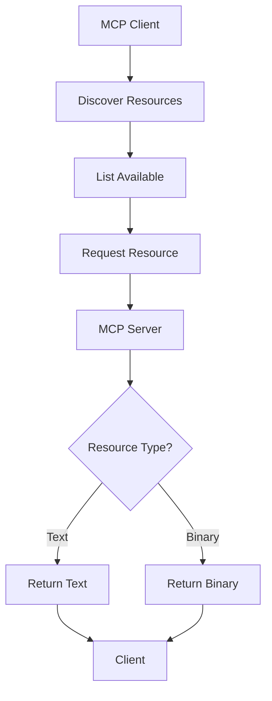

# MCP Resources and Prompt Patterns

## Question
How do you expose resources and define prompts in MCP?

## Answer
Resources and prompts are core abstractions in MCP for data and template management.

### Resource Types
- **Text Resources** - Documents, code, configuration
- **Binary Resources** - Images, PDFs, archives
- **Dynamic Resources** - Real-time data
- **URI-based** - File paths, URLs
- **Indexed** - Searchable collections

### Resource Definition
```json
{
  "uri": "documents:///annual-report.pdf",
  "name": "Annual Report 2024",
  "description": "Company annual report",
  "mimeType": "application/pdf"
}
```

### Prompt Types
- **System Prompts** - LLM instructions
- **User Prompts** - Query templates
- **Context Prompts** - Background information
- **Example Prompts** - Few-shot demonstrations
- **Conditional Prompts** - Logic-based selection

### Prompt Definition
```json
{
  "name": "code-review",
  "description": "Review code for quality",
  "arguments": [
    {
      "name": "language",
      "description": "Programming language",
      "required": true
    }
  ]
}
```

### Best Practices
- **Clear Naming** - Descriptive URIs
- **Rich Metadata** - Detailed descriptions
- **Versioning** - Track changes
- **Caching** - Performance optimization
- **Access Control** - Selective exposure

### Indexing Strategies
- **Full-text Search** - Document content
- **Metadata Search** - Tags, attributes
- **Hybrid Search** - Combined approach
- **Semantic Search** - Embedding-based

## Resource and Prompt Flow


## Key Points
- Resources enable data integration
- Prompts provide reusable templates
- Metadata enables discovery
- Caching improves performance

## Interview Tips
- Discuss resource organization strategies
- Explain prompt design patterns
- Share indexing approaches

## References
- [MCP Resource Specification](https://modelcontextprotocol.io/)
- [Prompt Engineering Best Practices](https://platform.openai.com/docs/guides/prompt-engineering)
