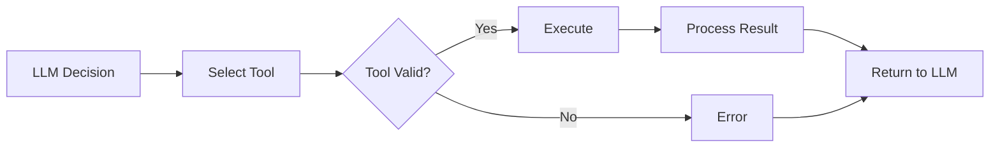

# Implementing Tool Use in MCP

## Question
How do you design and expose tools through MCP?

## Answer
MCP tools enable LLMs to call external functions and take actions.

### Tool Definition
```json
{
  "name": "search_documents",
  "description": "Search documents by keyword",
  "inputSchema": {
    "type": "object",
    "properties": {
      "query": {
        "type": "string",
        "description": "Search query"
      },
      "limit": {
        "type": "integer",
        "description": "Max results"
      }
    },
    "required": ["query"]
  }
}
```

### Tool Categories
- **Data Retrieval** - Query information
- **Data Modification** - Create, update, delete
- **Integration** - External API calls
- **Automation** - Workflow execution
- **Analysis** - Computation and processing

### Implementation Pattern
1. **Define Schema** - Input/output structure
2. **Implement Handler** - Execute logic
3. **Error Handling** - Graceful failures
4. **Response Format** - Structured output
5. **Logging** - Track usage

### Safety Mechanisms
- **Input Validation** - Type checking
- **Authorization** - Permission checks
- **Rate Limiting** - Prevent abuse
- **Execution Timeout** - Resource limits
- **Output Sanitization** - Safe responses

### Tool Discovery
- **Listing Tools** - Enumerate available
- **Descriptions** - Clear documentation
- **Schema Validation** - Type safety
- **Capability Negotiation** - Feature support

## Tool Execution Flow


## Key Points
- Clear schemas enable robust integration
- Validation prevents execution errors
- Safety first in tool design
- Error handling is critical

## Interview Tips
- Discuss tool safety strategies
- Explain schema design
- Share production tool deployments

## References
- [OpenAI Tool Use](https://platform.openai.com/docs/guides/function-calling)
- [MCP Tools Specification](https://modelcontextprotocol.io/)
