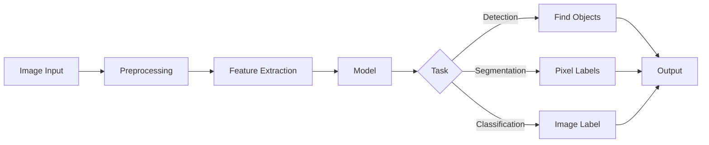

# Computer Vision Fundamentals

## Question
What are the main computer vision tasks and architectures?

## Answer
Computer vision uses deep learning to extract meaning from visual data.

### Main Tasks
- **Image Classification** - Predict category
- **Object Detection** - Find and classify objects
- **Semantic Segmentation** - Pixel-level classification
- **Instance Segmentation** - Individual object masks
- **Pose Estimation** - Key point detection
- **Face Recognition** - Identity matching

### Key Architectures
- **CNN** - Convolutional neural networks
- **ResNet** - Residual connections
- **VGG** - Deep convolutional
- **YOLO** - Real-time detection
- **Transformer** - Vision transformers
- **Diffusion** - Generative models

### Convolutional Neural Networks
- **Convolution** - Feature extraction
- **Pooling** - Dimensionality reduction
- **Normalization** - Training stability
- **Non-linearity** - Activation functions
- **Fully Connected** - Classification

### Object Detection Approaches
- **R-CNN** - Region-based
- **YOLO** - Single-shot
- **SSD** - Multi-scale
- **Faster R-CNN** - Improved R-CNN
- **Transformer-based** - DETR

### Transfer Learning
- **ImageNet Pre-training** - General features
- **Fine-tuning** - Task adaptation
- **Data Augmentation** - More training data
- **Regularization** - Prevent overfitting

## Computer Vision Pipeline

## Key Points
- Pre-trained models speed development
- Data augmentation improves robustness
- Ensemble improves accuracy
- Monitor for bias

## Interview Tips
- Discuss architecture trade-offs
- Explain transfer learning
- Share computer vision projects

## References
- [Computer Vision Guide](https://www.deeplearningbook.org/)
- [PyTorch Vision](https://pytorch.org/vision/)
