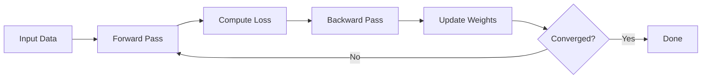

# Neural Networks and Deep Learning

## Question
What are neural networks and how do they work?

## Answer
Neural networks are computational models inspired by biological brains.

### Network Architecture
- **Input Layer** - Feature input
- **Hidden Layers** - Feature transformation
- **Output Layer** - Prediction
- **Weights** - Learnable parameters
- **Activation Functions** - Non-linearity

### Activation Functions
- **ReLU** - Rectified Linear Unit (most common)
- **Sigmoid** - Smooth 0-1 mapping
- **Tanh** - Smooth -1 to 1 mapping
- **Softmax** - Probability distribution
- **ELU, Swish** - Variants

### Training Process
1. **Forward Pass** - Compute output
2. **Compute Loss** - Compare to target
3. **Backward Pass** - Compute gradients
4. **Update Weights** - Gradient descent
5. **Repeat** - Multiple epochs

### Optimization Algorithms
- **SGD** - Stochastic gradient descent
- **Adam** - Adaptive learning rates
- **RMSprop** - Root mean square
- **Momentum** - Accelerated descent
- **AdaGrad** - Per-parameter learning rates

### Deep Neural Networks
- **Very Deep** - Many hidden layers
- **Vanishing Gradient** - Training difficulty
- **Batch Normalization** - Stabilize training
- **Dropout** - Prevent overfitting
- **Regularization** - L1, L2 penalties

## Neural Network Training Loop

## Key Points
- More layers enable complex patterns
- Scaling data improves training
- Regularization prevents overfitting
- GPUs essential for training

## Interview Tips
- Explain architecture decisions
- Discuss training challenges
- Share deep learning experiences

## References
- [Deep Learning Book](https://www.deeplearningbook.org/)
- [Neural Networks Explained](https://arxiv.org/abs/1404.7828)
