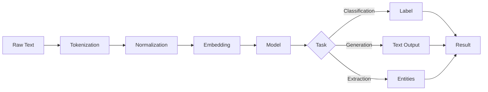

# Natural Language Processing Basics

## Question
What are the fundamentals of natural language processing?

## Answer
NLP enables computers to understand and generate human language.

### Core NLP Tasks
- **Tokenization** - Split into words
- **POS Tagging** - Part of speech
- **Named Entity Recognition** - Extract entities
- **Sentiment Analysis** - Opinion detection
- **Machine Translation** - Language-to-language
- **Summarization** - Condensed version
- **Q&A** - Answer questions

### Text Representations
- **Bag of Words** - Word frequency
- **TF-IDF** - Term importance
- **Word Embeddings** - Word2Vec, GloVe
- **Contextual** - BERT, GPT embeddings
- **Sentence Embeddings** - Sentence vectors

### NLP Architectures
- **RNN/LSTM** - Sequence modeling
- **GRU** - Gated recurrent unit
- **Attention** - Focus mechanism
- **Transformers** - Self-attention
- **BERT** - Bidirectional encoder

### Modern Approaches
- **Pre-trained Models** - Transfer learning
- **Fine-tuning** - Task adaptation
- **Prompt Engineering** - Instruction tuning
- **Few-shot Learning** - Limited examples
- **Zero-shot** - No task-specific training

### Common Libraries
- **NLTK** - General NLP
- **spaCy** - Production NLP
- **Hugging Face** - Transformers
- **TextBlob** - Simple processing
- **Gensim** - Topic modeling

## NLP Pipeline

## Key Points
- Pre-trained models essential
- Language understanding requires context
- Embeddings capture semantics
- Scale with transformer models

## Interview Tips
- Discuss representation methods
- Explain modern architectures
- Share NLP project experiences

## References
- [NLP with Transformers](https://www.oreilly.com/library/view/natural-language-processing/9781098136789/)
- [Hugging Face Course](https://huggingface.co/course)
