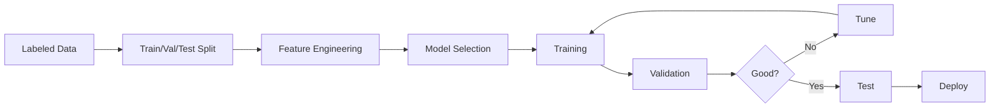

# Supervised Learning Fundamentals

## Question
What is supervised learning and what algorithms are commonly used?

## Answer
Supervised learning uses labeled data to train models for prediction tasks.

### Task Types
- **Regression** - Continuous output
- **Classification** - Discrete categories
- **Multi-class** - Many categories
- **Multi-label** - Multiple outputs
- **Structured Prediction** - Sequence/tree output

### Common Algorithms
- **Linear Regression** - Simple continuous
- **Logistic Regression** - Binary classification
- **Decision Trees** - Interpretable
- **Random Forest** - Ensemble trees
- **SVM** - Support vector machines
- **Neural Networks** - Deep learning

### Training Process
1. **Collect Data** - Gather labeled examples
2. **Split Data** - Train/validation/test
3. **Choose Model** - Algorithm selection
4. **Train Model** - Learn parameters
5. **Validate** - Tune hyperparameters
6. **Evaluate** - Test set performance
7. **Deploy** - Production use

### Evaluation Metrics
- **Classification**: Accuracy, Precision, Recall, F1-Score
- **Regression**: MAE, MSE, RMSE, R²
- **ROC-AUC**: Threshold-independent
- **Confusion Matrix**: Detailed breakdown

### Overfitting vs Underfitting
```
Underfitting: Model too simple
  ↓
Sweet Spot: Good generalization
  ↑
Overfitting: Model too complex
```

## Supervised Learning Pipeline


## Key Points
- More data generally better than complex models
- Feature engineering crucial
- Validate on unseen test data
- Monitor performance post-deployment

## Interview Tips
- Discuss algorithm trade-offs
- Explain overfitting prevention
- Share model selection experience

## References
- [Introduction to Statistical Learning](https://www.statlearning.com/)
- [Scikit-learn Documentation](https://scikit-learn.org/)
