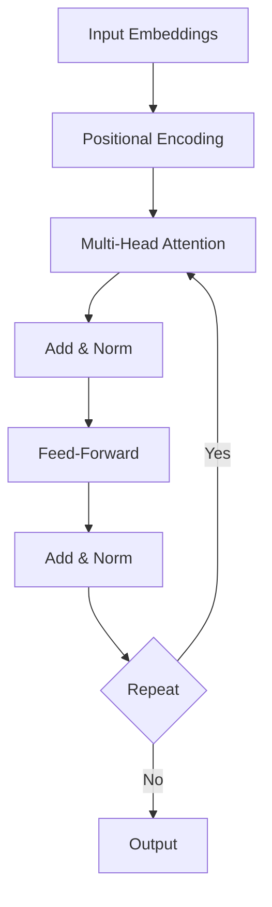

# Transformer Architecture

## Question
What is the Transformer architecture and why is it revolutionary?

## Answer
Transformers use self-attention to process sequences in parallel, enabling massive scaling.

### Key Components
- **Attention Mechanism** - Weight relationships
- **Multi-Head Attention** - Multiple representation subspaces
- **Feed-Forward** - Additional non-linearity
- **Layer Normalization** - Training stability
- **Positional Encoding** - Sequence information

### Attention Mechanism
```
Attention(Q, K, V) = softmax(Q·K^T / √d_k)·V

Where:
  Q = Query matrix
  K = Key matrix
  V = Value matrix
  d_k = Key dimension
```

### Transformer Applications
- **Language Models** - GPT, BERT
- **Machine Translation** - Seq2Seq
- **Question Answering** - Reading comprehension
- **Vision Transformers** - Image classification
- **Multimodal** - Combined inputs

### Pre-training and Fine-tuning
- **Pretraining** - Large unsupervised corpus
- **Transfer Learning** - Leverage pre-trained
- **Fine-tuning** - Task-specific adaptation
- **Domain Adaptation** - Different domains

### Advantages
- **Parallelizable** - Process whole sequence
- **Long-range Dependencies** - Attention span
- **Scalable** - Grows with data
- **Transferable** - Pre-trained models

### Challenges
- **Computational Cost** - O(n²) complexity
- **Long Sequences** - Memory intensive
- **Interpretability** - Black box
- **Training Data** - Requires massive data

## Transformer Architecture


## Key Points
- Foundation of modern LLMs
- Attention mechanism revolutionary
- Scales well with data
- Transfer learning very effective

## Interview Tips
- Explain attention mechanism
- Discuss scaling properties
- Share practical applications

## References
- [Attention Is All You Need](https://arxiv.org/abs/1706.03762)
- [Transformer Architecture](https://www.deeplearningbook.org/)
