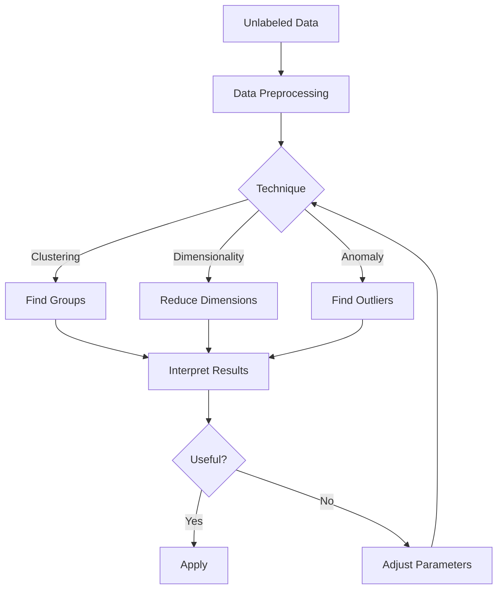

# Unsupervised Learning

## Question
What unsupervised learning techniques are used for pattern discovery?

## Answer
Unsupervised learning finds patterns in unlabeled data.

### Clustering
- **K-Means** - Partition into k clusters
- **Hierarchical** - Tree-based clustering
- **DBSCAN** - Density-based
- **Gaussian Mixture** - Probabilistic clusters
- **Spectral** - Graph-based

### Dimensionality Reduction
- **PCA** - Principal Component Analysis
- **t-SNE** - Visualization
- **UMAP** - Uniform Manifold Approximation
- **Autoencoder** - Neural network compression
- **Feature Selection** - Choose important features

### Anomaly Detection
- **Isolation Forest** - Outlier isolation
- **Local Outlier Factor** - Density-based
- **One-Class SVM** - Boundary learning
- **Autoencoders** - Reconstruction error
- **Isolation Forests** - Tree-based

### Association Rules
- **Apriori** - Frequent itemsets
- **Eclat** - Depth-first search
- **FP-Growth** - Tree-based
- **Support, Confidence** - Rule quality

### Use Cases
- **Customer Segmentation** - Clustering
- **Recommendation Systems** - Similarity
- **Fraud Detection** - Anomalies
- **Data Exploration** - Pattern discovery
- **Compression** - Dimensionality reduction

## Unsupervised Learning Workflow

## Key Points
- Evaluation harder without labels
- Domain expertise crucial
- Preprocessing important
- Validate with domain experts

## Interview Tips
- Discuss technique selection
- Explain evaluation approaches
- Share exploration stories

## References
- [Unsupervised Learning Guide](https://www.oreilly.com/library/view/hands-on-machine-learning/9781492032632/)
- [Clustering Algorithms](https://en.wikipedia.org/wiki/Cluster_analysis)
