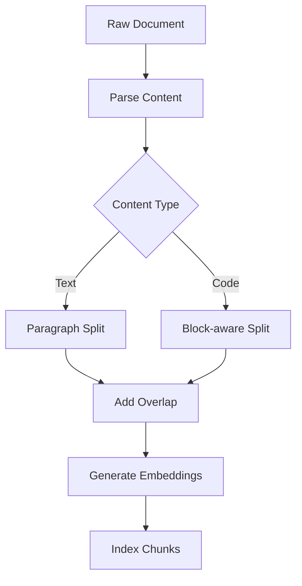

# Document Chunking for RAG

## Question
How do you effectively chunk documents for RAG systems?

## Answer
Chunking strategy significantly impacts retrieval quality and model performance.

### Chunking Strategies
- **Fixed-size Chunks** - Simple but may split contexts
- **Overlap Chunks** - Add context preservation
- **Semantic Chunking** - Split on meaningful boundaries
- **Hierarchical Chunking** - Multi-level structure
- **Dynamic Chunking** - Adaptive based on content

### Chunk Size Selection
- **Small Chunks (128-256)** - High precision, many chunks
- **Medium Chunks (256-512)** - Balanced approach
- **Large Chunks (512-1024)** - Better context, fewer results

### Content-Aware Chunking
- **Code Blocks** - Keep code together
- **Paragraphs** - Natural boundaries
- **Sentences** - Fine-grained chunks
- **Sections** - Document structure

### Best Practices
1. **Preserve Context** - Use overlap windows
2. **Maintain Boundaries** - Don't split mid-sentence
3. **Include Metadata** - Add source information
4. **Track Position** - Remember original location
5. **Version Documents** - Handle updates

### Tools & Libraries
- **LangChain** - Multiple splitting strategies
- **Llama Index** - Document parsing
- **Unstructured** - Multi-format support
- **PyPDF2** - PDF extraction

## Chunking Process

## Key Points
- Chunking strategy affects retrieval quality
- Balance between context and granularity
- Content-aware approach yields best results
- Overlap windows preserve context

## Interview Tips
- Explain trade-offs in chunk sizes
- Discuss content-specific strategies
- Share optimization experiences

## References
- [Chunking Strategy Analysis](https://www.anthropic.com/research/long-context-window-performance)
- [LangChain Splitters](https://python.langchain.com/docs/modules/data_connection/document_loaders/)
