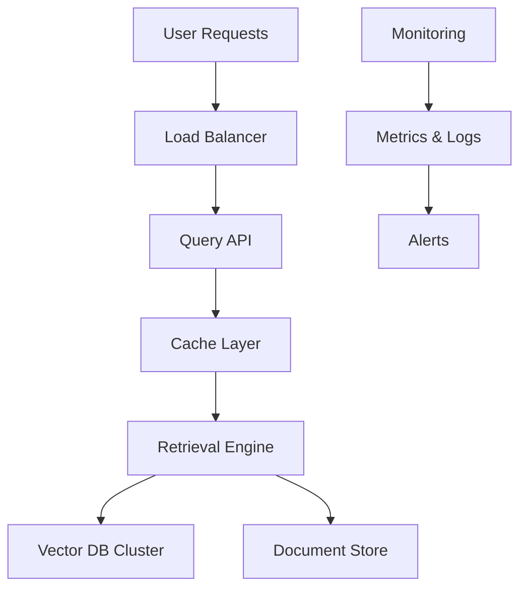

# Building Enterprise-Scale RAG Systems

## Question
What considerations are important when deploying RAG in enterprise environments?

## Answer
Enterprise RAG requires scalability, security, compliance, and reliability measures.

### Enterprise Requirements
- **Scalability** - Handle millions of documents
- **Security** - Data protection and access control
- **Compliance** - GDPR, HIPAA, SOC 2
- **Reliability** - 99.9%+ uptime
- **Monitoring** - Performance and quality metrics
- **Cost Optimization** - Efficient resource usage

### Architecture Considerations
- **Multi-tenancy** - Isolated data per customer
- **Distributed Retrieval** - Partition across regions
- **Caching Layers** - Reduce database load
- **Load Balancing** - Distribute query load
- **Failover** - Automatic recovery

### Data Management
- **Data Governance** - Clear ownership
- **Version Control** - Track document changes
- **Retention Policies** - Archive old content
- **Access Control** - Role-based permissions
- **Audit Logging** - Track all operations

### Quality Assurance
- **Continuous Monitoring** - Track metrics
- **A/B Testing** - Compare strategies
- **User Feedback** - Incorporate feedback loop
- **Bias Detection** - Monitor for fairness
- **Ground Truth** - Maintain quality baselines

### Infrastructure
- **Auto-scaling** - Handle peak loads
- **Geographic Distribution** - Reduce latency
- **Backup & Recovery** - Data durability
- **Observability** - Logging and tracing
- **Cost Management** - Resource optimization

## Enterprise Architecture

## Key Points
- Plan for scale from the beginning
- Implement comprehensive monitoring
- Design with security in mind
- Regular compliance audits
- Cost-effective resource management

## Interview Tips
- Discuss scalability challenges
- Share security implementations
- Explain compliance approaches
- Discuss monitoring strategies

## References
- [Enterprise AI Implementation Guide](https://www.mckinsey.com/featured-insights/artificial-intelligence/the-state-of-ai-in-2024)
- [RAG Production Systems](https://arxiv.org/abs/2401.08406)
