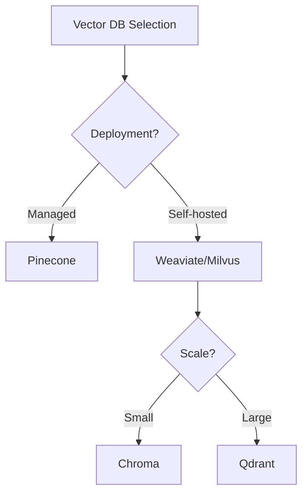

# Vector Databases for RAG

## Question
What vector databases are used in RAG systems and how do you choose one?

## Answer
Vector databases store and search high-dimensional embeddings efficiently.

### Popular Vector Databases
- **Pinecone** - Managed, serverless vector DB
- **Weaviate** - Open-source with semantic search
- **Milvus** - Open-source, enterprise-ready
- **Qdrant** - Similarity search engine
- **Chroma** - Embedded, lightweight
- **FAISS** - Facebook's similarity search library
- **Redis Search** - Redis with vector capabilities
- **Elasticsearch** - Vector search integration

### Key Features
- **Similarity Search** - Fast nearest neighbor search
- **Scalability** - Handle millions of vectors
- **Filtering** - Metadata filtering support
- **Performance** - Sub-millisecond latency
- **Replication** - High availability options

### Indexing Methods
- **HNSW** - Hierarchical Navigable Small World
- **IVF** - Inverted File
- **LSH** - Locality Sensitive Hashing
- **Quantization** - Reduce memory footprint

### Selection Criteria
- **Scale** - Number of vectors to store
- **Latency** - Query response time requirements
- **Cost** - Infrastructure expenses
- **Features** - Filtering, metadata, updates
- **Operations** - Maintenance overhead

## Comparison Table

## Key Points
- Choose based on scale and latency requirements
- HNSW offers best speed-accuracy trade-off
- Managed services reduce operational burden
- Hybrid solutions combine multiple methods

## Interview Tips
- Discuss trade-offs between options
- Share production deployment experience
- Explain indexing method selection

## References
- [Vector Database Comparison](https://www.databricks.com/blog/2023/04/13/vector-databases-are-not-just-for-llms.html)
- [HNSW Paper](https://arxiv.org/abs/1802.02413)
