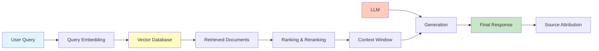

# What is RAG (Retrieval Augmented Generation)?

## Question

What is Retrieval Augmented Generation (RAG) and why is it important in modern AI systems?

## Answer

**Retrieval Augmented Generation (RAG)** is a technique that combines information retrieval with generative AI to provide more accurate, current, and contextually relevant responses. Instead of relying solely on the knowledge encoded in a model's weights, RAG retrieves relevant information from external sources (documents, databases) and uses that as context for generation.

### Why RAG is Critical

```
Without RAG:          With RAG:
LLM Only              Documents → Retriever → Context
  ↓                            ↓
Hallucination Risk           Query
Outdated Info       ↓
Limited Context     ↓
No Source Facts     Retriever → Context
                    ↓
                    LLM → Better Answer
                    ↓
                    Generation with Facts
```

### RAG Workflow

1. **Query**: User asks a question
2. **Embedding**: Convert query to vector representation
3. **Retrieval**: Search vector database for similar documents
4. **Ranking**: Order results by relevance
5. **Context Building**: Combine top results as context
6. **Generation**: LLM generates answer using retrieved context
7. **Response**: Return answer with source references

### RAG vs. Fine-tuning

| Aspect | RAG | Fine-tuning |
|--------|-----|---|
| **Update Frequency** | Real-time (retrieves current docs) | Requires retraining |
| **Cost** | Lower (no retraining) | Higher (expensive training) |
| **Flexibility** | Can swap data sources easily | Fixed after training |
| **Knowledge Scope** | Scales to millions of documents | Limited by model capacity |
| **Latency** | Requires retrieval step | Faster inference |
| **Maintenance** | Easier | More complex |

## Architecture Diagram



## Key Points

✅ **Reduces hallucinations** by grounding responses in retrieved facts  
✅ **Enables real-time knowledge** without retraining models  
✅ **Scales to large document collections** via vector databases  
✅ **Improves factuality and accuracy** significantly  
✅ **Cost-effective** compared to continuous fine-tuning  
✅ **Provides source attribution** for transparency  

## Interview Tips

1. **Start with the problem**: "LLMs can hallucinate and have training cutoff dates"
2. **Explain the solution**: "RAG retrieves relevant context before generation"
3. **Give real example**: "Q&A chatbot over company documents using RAG"
4. **Discuss tradeoffs**: "Adds latency but improves accuracy and freshness"
5. **Mention challenges**: "Retrieval quality, context window limitations"

## RAG Challenges & Solutions

| Challenge | Solution |
|-----------|----------|
| Poor retrieval quality | Better embeddings, reranking models |
| Context window overflow | Summarization, hierarchical retrieval |
| Irrelevant results | Query refinement, metadata filtering |
| Hallucinations persist | Better prompt engineering, confidence scores |
| Latency | Caching, async retrieval, indexing optimization |

## Common Follow-up Questions

**Q: How do you evaluate RAG systems?**
- Retrieval: Precision, Recall, NDCG (Normalized Discounted Cumulative Gain)
- Generation: BLEU, ROUGE, human evaluation
- End-to-end: Factuality, relevance, user satisfaction

**Q: What vector database would you choose?**
- Pinecone: Managed, easy to scale
- Weaviate: Open-source, flexible
- Milvus: High-performance, open-source
- Qdrant: Modern, optimized

**Q: How do you handle very large documents?**
- Chunking strategies (sliding window, semantic)
- Hierarchical retrieval (chunk → document → corpus level)
- Summarization of retrieved documents

## References

- [RAG Paper - Lewis et al.](https://arxiv.org/abs/2005.11401)
- [Advanced RAG Techniques](https://arxiv.org/abs/2401.15884)
- [LlamaIndex RAG Guide](https://docs.llamaindex.ai/)
- [LangChain RAG Documentation](https://python.langchain.com/docs/modules/retrieval_augmented_generation/)

---

**Related Topics**: Vector Databases, Retrieval Strategies, Enterprise RAG, LLMOps

**Next**: Explore [Types of RAG](./types-of-rag.md)
