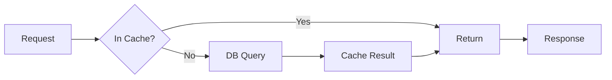

# Caching Strategies for Performance

## Question
What caching strategies optimize system performance?

## Answer
Multi-layer caching reduces latency and database load.

### Cache Layers
1. **Client-side** - Browser cache
2. **CDN** - Geographic distribution
3. **Application** - In-memory cache
4. **Database Query** - Query result cache
5. **Page-level** - Rendered HTML

### Cache Invalidation
- **TTL** - Time-based expiration
- **Event-based** - Invalidate on change
- **LRU** - Least recently used
- **LFU** - Least frequently used
- **Random** - Random eviction

### Caching Patterns
- **Cache-Aside** - Load from DB if miss
- **Write-Through** - Write to cache and DB
- **Write-Behind** - Write to cache, async DB
- **Refresh-Ahead** - Proactive refresh

### Popular Tools
- **Redis** - In-memory data store
- **Memcached** - Simple caching
- **CloudFlare** - CDN caching
- **Varnish** - HTTP caching
- **Nginx** - Application caching

### Cache Metrics
- **Hit Rate** - % of cache hits
- **Eviction Rate** - % evicted
- **Memory Usage** - Storage consumed
- **Latency Reduction** - Speed improvement
- **Cost Savings** - Database load reduction

## Cache Architecture

## Key Points
- Choose right cache strategy
- Monitor hit rates
- Plan for cache invalidation
- Balance memory vs speed

## Interview Tips
- Discuss invalidation strategies
- Explain trade-offs
- Share optimization experiences

## References
- [Cache Invalidation](https://www.slideshare.net/slideshow/an-approach-to-consistent-caching-through-change-data-capture/229862055)
- [Redis Documentation](https://redis.io/documentation)
