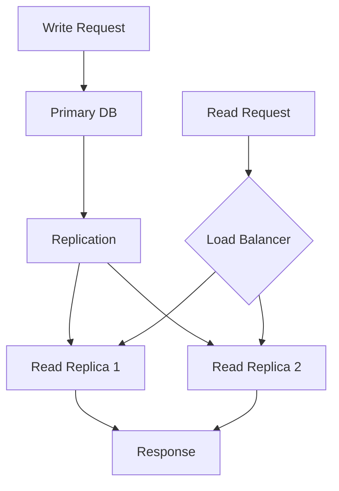

# Database Design Principles

## Question
How do you design databases for scalability and performance?

## Answer
Database design balances normalization, performance, and scalability.

### Database Types
- **RDBMS** - Relational (PostgreSQL, MySQL)
- **NoSQL** - Document (MongoDB), Key-Value (Redis)
- **Time-Series** - InfluxDB, Prometheus
- **Graph** - Neo4j, ArangoDB
- **Search** - Elasticsearch

### Design Principles
1. **Normalization** - Reduce redundancy
2. **Indexing** - Speed up queries
3. **Partitioning** - Scale data
4. **Caching** - Reduce latency
5. **Monitoring** - Track performance

### Indexing Strategies
- **Primary Key** - Unique row identifier
- **Secondary** - Search columns
- **Composite** - Multiple columns
- **Full-Text** - Document search
- **Spatial** - Geographic queries

### Partitioning Methods
- **Range** - Value ranges
- **Hash** - Hash-based
- **List** - Specific values
- **Composite** - Combination

### Query Optimization
```
SELECT ... FROM table
WHERE indexed_column = value  ✓ Fast
WHERE non_indexed = value ✗ Slow
SELECT * FROM table ✗ Expensive
SELECT col1, col2 ✓ Efficient
```

### Replication Strategies
- **Master-Slave** - Read replicas
- **Master-Master** - Multi-write
- **Cluster** - Distributed
- **Sharding** - Data distribution

## Database Architecture


## Key Points
- Choose database for use case
- Plan for partitioning early
- Monitoring catches issues
- Optimize queries regularly

## Interview Tips
- Discuss database selection criteria
- Explain indexing strategies
- Share optimization stories

## References
- [Database Design Best Practices](https://www.oreilly.com/library/view/database-design/9781491902493/)
- [PostgreSQL Documentation](https://www.postgresql.org/docs/)
